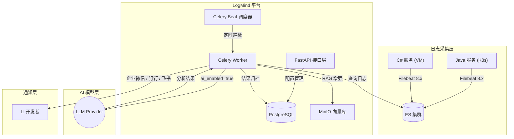
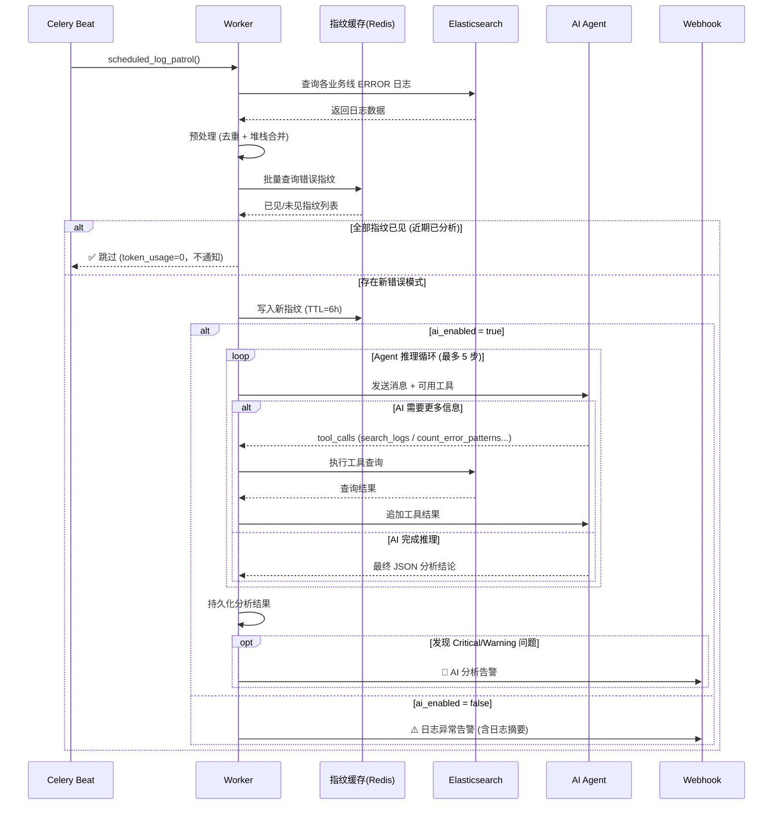

<div align="center">
  <br/>
  <h1>🧠 LogMind</h1>
  <p><b>智能日志分析与告警平台</b></p>
  <p>AI-Powered Log Analysis & Alert Platform for Cloud-Native and Hybrid Infrastructure</p>

  <p>
    <a href="https://python.org"></a>
    <a href="https://fastapi.tiangolo.com"></a>
    
    
    
    <a href="LICENSE"></a>
  </p>
</div>

<br/>

> LogMind 对接企业已有的 ELK 日志基础设施，通过 AI 大模型自动识别错误模式、追踪异常根因、生成修复建议，并将告警推送至企业微信 / 钉钉 / 飞书。  
> 支持 **Java (K8s)** 和 **C# (.NET/VM)** 混合架构，提供灵活的 **AI 开关**：开启时进行深度智能分析，关闭时自动降级为轻量化异常通知。  
> 内置 **AI Agent 自主推理**：AI 可主动调用 ES 工具进行多步查询，像真正的 SRE 一样逐步缩小排查范围，而不仅仅是分析一次性日志快照。

---

### 📑 目录

- [核心能力](#-核心能力)
- [架构设计](#-架构设计)
- [功能矩阵](#-功能矩阵)
- [成本控制配置](#-成本控制配置)
- [快速开始](#-快速开始)
- [业务线配置指南](#-业务线配置指南)
- [通知模板说明](#-通知模板说明)
- [API 接口参考](#-api-接口参考)
- [项目结构](#-项目结构)
- [未来路标](#-未来路标)
- [参与贡献](#-参与贡献)
- [开源协议](#-开源协议)

---

## ✨ 核心能力

### 🔌 无缝对接企业 ELK

直接读取已有 Elasticsearch 中的 Filebeat 日志，无需改造日志采集链路。支持 Data Stream 索引（`.ds-*`）和传统索引。

### 🤖 AI 大模型弹性分析

- 开箱即用对接 OpenAI / Claude / Gemini / DeepSeek / 内网私有模型
- **AI 开关**：按业务线独立控制，关闭即零 Token 消耗
- AI 异常自动降级：模型故障时自动切换为原始日志通知，告警不丢失

### 🧠 AI Agent 自主推理（多步工具调用）

区别于传统「一次性 Prompt-Response」模式，LogMind 内置 Agent 推理循环。AI 拥有主动查询能力，可在一次分析中发起多步工具调用：

| Agent Tool | 作用 |
|-----------|------|
| `search_logs` | 自由构造条件搜索更多日志（关键词、级别、域名、时间段） |
| `get_log_context` | 查看某个时间点前后 N 分钟的完整上下文 |
| `count_error_patterns` | 按异常类型 / 域名 / 时间段聚合统计错误频率 |
| `list_available_indices` | 发现其他相关服务的 ES 索引 |
| `search_knowledge_base`| **(🆕 新增)** 根据相关性智能检索内部知识库、SOP 和历史故障处理手册 |

**典型推理链**：发现大量连接超时 → 调用 `count_error_patterns` 确认频率 → 调用 `search_logs` 查上游服务 → 调用 `get_log_context` 追溯发生前后环境 → 给出根因结论。

### 💰 错误指纹去重 (Token 节省)

基于 Redis 的跨任务错误指纹缓存，避免对同样的错误模式重复调用 AI：

- 每条错误生成唯一指纹（异常类 + 消息哈希）
- 指纹命中（TTL 内已分析）→ 自动跳过 AI 推理，`token_usage = 0`
- 指纹全部命中时任务标记完成但**不发告警通知**，降低噪音
- TTL 过期后同类错误会被重新分析（默认 6 小时）

### 🌐 多语言日志智能解析

| 语言 | 日志级别提取 | 堆栈检测 | 部署环境 |
|------|------------|---------|---------|
| **Java** | `gy.filetype` 映射 (error.log / info.log) | `at pkg.Class(File.java:123)` + `Caused by:` | K8s Pod |
| **C#** | message NLog 正则 (`时间 [线程] ERROR 类名`) | `at NS.Class() in File.cs:line N` | Windows VM |
| **Python** | message 关键词 | `Traceback` + `File "xxx", line N` | 通用 |
| **Go** | message 关键词 | `goroutine` + `panic` | K8s / VM |

### 📨 模板化 Webhook 通知

三种告警模板自动匹配场景，支持企业微信 / 钉钉 / 飞书 webhook 自动适配：

| 模板 | 触发场景 | 包含信息 |
|------|---------|---------|
| ⚠️ 日志异常告警 | AI 关闭，检测到错误日志 | 业务线、站点、环境、语言、日志数、异常摘要 |
| 🔴 AI 分析告警 | AI 分析发现 Critical 问题 | 告警级别、AI 结论、影响范围、任务 ID |
| 🛑 AI 流程异常 | AI 模型调用失败 | 错误信息、故障原因 + 降级通知 |

### 🏢 企业级多租户

天然基于 **租户 → 业务线** 层级隔离。每个业务线独立配置 ES 索引、开发语言、AI 开关、webhook 地址、告警阈值。

---

## 🏗 架构设计

### 系统架构



### 分析流程



---

## 📋 功能矩阵

| 模块 | 功能 | 状态 |
|------|------|------|
| **日志接入** | Filebeat → ES 日志读取 | ✅ |
| | Data Stream 索引 (`.ds-*`) 支持 | ✅ |
| | 自定义 ES 索引模式 | ✅ |
| **日志解析** | Java `gy.filetype` 级别映射 | ✅ |
| | C# NLog/log4net 级别解析 | ✅ |
| | Java 堆栈异常合并 | ✅ |
| | C# .NET 堆栈异常合并 | ✅ |
| | Filebeat multiline 感知 | ✅ |
| **AI 分析** | 多模型支持 (OpenAI/Claude/DeepSeek...) | ✅ |
| | 配置化 Prompt 模板 (YAML + DB) | ✅ |
| | Java / C# 双语言堆栈分析 Prompt | ✅ |
| | 业务线级 AI 开关 | ✅ |
| | AI 失败降级通知 | ✅ |
| | **🆕 AI Agent 多步推理** | ✅ |
| | **🆕 Function Calling 工具调用 (4 个 ES 工具)** | ✅ |
| | **🆕 错误指纹去重 (跨任务 Redis 缓存)** | ✅ |
| **告警通知** | 企业微信 Webhook | ✅ |
| | 钉钉 Webhook | ✅ |
| | 飞书 Webhook | ✅ |
| | 模板化通知 (3 种场景) | ✅ |
| | 业务线独立 Webhook URL | ✅ |
| **平台能力** | 多租户隔离 | ✅ |
| | JWT 认证 + 角色鉴权 | ✅ |
| | API Key Fernet 加密存储 | ✅ |
| | Celery Beat 定时巡检 | ✅ |
| | 巡检冷却控制 | ✅ |
| **🆕 RAG 增强** | 知识库文本文档分块 (Chunking) | ✅ |
| | ES 8.x `dense_vector` 原生向量存储 | ✅ |
| | Agent 智能 KNN 检索 (按需唤醒) | ✅ |

---

## 💰 成本控制配置

LogMind 内置多层 Token 消耗控制机制，通过 `.env` 配置：

| 环境变量 | 默认值 | 说明 |
|---------|--------|------|
| `ANALYSIS_MAX_LOGS_PER_TASK` | `500` | 单次分析最大抓取日志数 |
| `ANALYSIS_COOLDOWN_MINUTES` | `30` | 同一业务线两次自动巡检最小间隔（分钟） |
| `ANALYSIS_FINGERPRINT_ENABLED` | `true` | 是否启用错误指纹去重 |
| `ANALYSIS_FINGERPRINT_TTL_HOURS` | `6` | 错误指纹缓存 TTL（小时） |
| `ANALYSIS_AGENT_ENABLED` | `true` | 是否启用 Agent 多步推理（关闭则退回一次性分析） |
| `ANALYSIS_AGENT_MAX_STEPS` | `5` | Agent 最大工具调用步数（超出自动停止） |

> **关闭 Agent 不影响分析功能**，只影响分析深度。设置 `ANALYSIS_AGENT_ENABLED=false` 可立即降低 Token 消耗 30-50%。

---

## 🚀 快速开始

### 环境要求

| 组件 | 版本要求 |
|------|---------|
| Python | ≥ 3.13 |
| PostgreSQL / MySQL | 任选其一 |
| Redis | ≥ 6.0 |
| Elasticsearch | ≥ 8.x（已部署，含 Filebeat 日志数据） |

### 源码部署

```bash
# 1. 克隆项目
git clone https://github.com/leeeway/LogMind.git
cd LogMind

# 2. 创建虚拟环境
python3 -m venv .venv
source .venv/bin/activate

# 3. 安装依赖
pip install -r requirements.txt

# 4. 配置环境变量
cp .env.example .env
# 编辑 .env，配置数据库、ES、Redis 连接信息

# 5. 初始化数据库 + 播种默认数据
python -m logmind.scripts.seed_prompts

# 6. 启动服务
make run      # FastAPI 主服务 (端口 8000)
make worker   # Celery Worker (新终端)
make beat     # Celery Beat 调度器 (新终端)
```

### Docker Compose 部署

```bash
# 一键启动（含 PostgreSQL + Redis）
docker-compose --env-file .env.production up -d --build
```

### 首次配置

1. **登录获取 Token**
   ```bash
   curl -X POST http://127.0.0.1:8000/api/v1/auth/login \
     -H "Content-Type: application/json" \
     -d '{"username": "admin", "password": "logmind2024!"}'
   ```

2. **注册 AI 模型提供商**（可选，仅 `ai_enabled=true` 时需要）
   ```bash
   curl -X POST http://127.0.0.1:8000/api/v1/providers \
     -H "Authorization: Bearer <TOKEN>" \
     -H "Content-Type: application/json" \
     -d '{
       "provider_type": "openai",
       "name": "主分析引擎",
       "api_base_url": "https://api.openai.com/v1",
       "api_key": "sk-xxx",
       "default_model": "gpt-4o",
       "priority": 1
     }'
   ```

3. **创建业务线** → 见下一节

---

## ⚙️ 业务线配置指南

业务线是 LogMind 的核心配置单元。每个业务线对应一组 ES 索引，独立控制日志解析策略、AI 开关和告警通道。

### Java 服务（K8s 部署 + AI 分析）

```json
{
  "name": "tong-kernel",
  "description": "通行证内核服务",
  "es_index_pattern": "master-stage-tong-kernel.cn*",
  "severity_threshold": "error",
  "language": "java",
  "ai_enabled": true,
  "webhook_url": "https://qyapi.weixin.qq.com/cgi-bin/webhook/send?key=xxx"
}
```

### C# 服务（Windows VM + 仅通知）

```json
{
  "name": "interface-security",
  "description": "安全接口服务 (C#)",
  "es_index_pattern": "master-interface.security.cn*",
  "severity_threshold": "error",
  "language": "csharp",
  "ai_enabled": false,
  "webhook_url": "https://qyapi.weixin.qq.com/cgi-bin/webhook/send?key=yyy"
}
```

### 配置字段说明

| 字段 | 类型 | 必填 | 说明 |
|------|------|------|------|
| `name` | string | ✅ | 业务线名称 |
| `es_index_pattern` | string | ✅ | ES 索引模式，支持通配符。多个用逗号分隔 |
| `severity_threshold` | string | — | 告警阈值：`debug` / `info` / `warning` / `error` / `critical` |
| `language` | string | — | 开发语言：`java` / `csharp` / `python` / `go` / `other`。决定日志解析策略 |
| `ai_enabled` | boolean | — | 大模型开关。`false` 时跳过 AI 推理，直接发送异常日志通知 |
| `webhook_url` | string | — | 业务线专属 webhook URL。为空时使用全局配置 |
| `field_mapping` | object | — | 自定义字段映射（高级用法） |

---

## 📨 通知模板说明

### AI 关闭 — 日志异常告警

当 `ai_enabled=false` 且检测到错误日志时，自动推送：

```
## ⚠️ 日志异常告警

**业务线**: interface-security
**站点**: interface.security.cn
**语言**: C#
**时间范围**: 2026-04-13 22:00 ~ 22:30
**异常日志数**: 15 条

---

**异常摘要**:
2026-04-13 19:09:56,856 [155] ERROR .Core.DBUtility.DataHelper
- SqlException: Timeout expired...

---
> 请及时排查处理。登录 LogMind 平台查看完整日志。
```

### AI 开启 — AI 分析告警

当 AI 分析发现 Critical 级别问题时推送：

```
## 🔴 LogMind AI 分析告警

**告警级别**: CRITICAL
**业务线**: tong-kernel
**站点**: stage-tong-kernel.cn (正式环境)
**分析日志数**: 23 条

---

**AI 分析结论**:
1. NullPointerException 根因：cn.tong.filter.ConvertToHumpFilter
   第 96 行 phoneToken 参数未做空值校验...

---
> 请及时处理。登录 LogMind 平台查看完整分析报告。
```

### AI 异常降级 — 流程异常通知

当 AI 模型调用失败（超时 / 配额 / Key 过期）时：

```
## 🛑 AI 分析流程异常

**业务线**: tong-kernel
**站点**: stage-tong-kernel.cn

**错误信息**: API Error: quota exceeded

---
> AI 模型调用异常，请检查模型配置和 API Key。
```

随后自动降级发送原始日志摘要通知。

---

## 🔌 API 接口参考

完整 Swagger 文档：`http://127.0.0.1:8000/docs`

### 核心接口

| 方法 | 路径 | 说明 |
|------|------|------|
| `POST` | `/api/v1/auth/login` | 登录获取 JWT Token |
| `POST` | `/api/v1/business-lines` | 创建业务线 |
| `PUT` | `/api/v1/business-lines/{id}` | 更新业务线（可单独切换 AI 开关） |
| `POST` | `/api/v1/analysis/tasks` | 手动触发分析任务 |
| `GET` | `/api/v1/analysis/tasks/{id}` | 获取分析任务结果 |
| `POST` | `/api/v1/providers` | 注册 AI 模型提供商 |
| `POST` | `/api/v1/alerts/rules` | 创建告警规则 |
| `GET` | `/api/v1/alerts/history` | 查看告警历史 |
| `GET` | `/api/v1/logs/search` | 搜索 ES 日志 |
| `GET` | `/api/v1/logs/stats` | 日志统计聚合 |
| `GET` | `/api/v1/logs/indices` | 列出 ES 索引 |

### 手动触发分析

```bash
curl -X POST "http://127.0.0.1:8000/api/v1/analysis/tasks" \
  -H "Authorization: Bearer <TOKEN>" \
  -H "Content-Type: application/json" \
  -d '{
    "business_line_id": "<BUSINESS_LINE_ID>",
    "task_type": "manual",
    "time_from": "2026-04-13T14:00:00Z",
    "time_to": "2026-04-13T22:00:00Z"
  }'
```

### 动态切换 AI 开关

```bash
curl -X PUT "http://127.0.0.1:8000/api/v1/business-lines/<ID>" \
  -H "Authorization: Bearer <TOKEN>" \
  -H "Content-Type: application/json" \
  -d '{"ai_enabled": false}'
```

---

## 📁 项目结构

```
LogMind/
├── src/logmind/
│   ├── core/                    # 基础设施层
│   │   ├── config.py            # Pydantic 配置管理
│   │   ├── database.py          # SQLAlchemy 异步引擎
│   │   ├── elasticsearch.py     # ES 客户端
│   │   ├── celery_app.py        # Celery 配置
│   │   ├── security.py          # JWT + Fernet 加密
│   │   └── dependencies.py      # FastAPI 依赖注入
│   ├── domain/                  # 业务领域层 (DDD)
│   │   ├── tenant/              # 租户 + 用户 + 业务线
│   │   ├── log/                 # ES 日志查询与解析
│   │   ├── analysis/            # AI 分析 Pipeline
│   │   │   ├── pipeline.py      # 8 阶段流水线定义
│   │   │   ├── agent_stage.py   # 🆕 AI Agent 多步推理 Stage
│   │   │   ├── agent_tools.py   # 🆕 ES 工具定义 (4 个 Function Calling 工具)
│   │   │   ├── fingerprint_stage.py # 🆕 错误指纹去重 Stage
│   │   │   └── tasks.py         # Celery 任务入口
│   │   ├── alert/               # 告警规则 + Webhook 通知
│   │   ├── provider/            # AI 模型提供商管理
│   │   ├── prompt/              # Prompt 模板引擎
│   │   ├── rag/                 # 🆕 RAG 知识库与向量检索 (ES knn_search)
│   │   └── dashboard/           # 仪表盘统计
│   ├── shared/                  # 通用组件
│   └── main.py                  # FastAPI 入口
├── configs/prompts/             # 内置 Prompt 模板 (YAML)
│   ├── log_analysis.yaml        # 通用日志分析模板
│   └── stack_trace_analysis.yaml # 堆栈异常分析模板
├── migrations/                  # 数据库迁移脚本
├── deploy/                      # 部署配置
├── docker-compose.yml           # Docker Compose 编排
├── Makefile                     # 常用命令
└── .env.example                 # 环境变量模板
```

---

## 🎯 未来路标 (Roadmap)

### v1.0 — 当前版本 ✅

- [x] 多租户 + 业务线隔离架构
- [x] Java / C# 双语言日志解析引擎
- [x] 多模型 AI Provider 管理 (OpenAI / DeepSeek / 内网模型)
- [x] Celery 分布式定时巡检 + 冷却控制
- [x] 业务线级 AI 开关 + AI 异常降级通知
- [x] 模板化 Webhook 多平台推送 (企业微信 / 钉钉 / 飞书)
- [x] Java + C# 堆栈异常智能合并与分析
- [x] Prompt 模板化管理 (YAML + DB 双源)
- [x] **AI Agent 多步推理** (Function Calling + ES 工具)
- [x] **错误指纹去重** (Redis 跨任务去重，节省 Token)
- [x] **RAG 知识库检索** (ES 原生向量检索 + Agent Tool 唤醒)

### v1.1 — 近期计划

- [ ] Web 管理界面 (Vue.js / React Dashboard)
- [ ] 告警规则引擎增强 (关键词 / 正则 / 阈值触发)
- [ ] 日志趋势分析看板
- [ ] Python / Go 堆栈解析深度支持
- [ ] 告警静默 / 聚合 / 升级策略
- [ ] RAG 文档管理界面 (本地上传/同步)

### v1.2 — 中期目标 (运维深度集成)

- [ ] 容器生态打通：K8s 事件流 (Event) / ConfigMap 变更关联分析
- [ ] 部署系统关联：查询近期发布记录，判断是否由于发版导致
- [ ] 多 ES 集群联邦查询支持
- [ ] Webhook 扩展：企业级飞书卡片进阶、Teams / Slack / Email

### v2.0 — 远期愿景 (Auto-Remediation 自动自愈)

- [ ] Agent 自治行动工具：`restart_pod`, `scale_deployment`
- [ ] 交互式自动修复：通过企微发送审批卡片，运维人员点击"同意"后执行
- [ ] AI 自愈建议 → 自动生成 Fix PR (对接 GitLab/GitHub)
- [ ] 跨服务分布式链路追踪 (Trace) 关联
- [ ] 自然语言日志查询 (Text-to-DSL 对话式监控)

---

## 🤝 参与贡献

LogMind 欢迎社区贡献！

1. **Fork** 本仓库
2. 创建特性分支 `git checkout -b feature/your-feature`
3. 遵循代码规范 `make lint && make format`
4. 提交更改 `git commit -m 'feat: add your feature'`
5. 推送分支 `git push origin feature/your-feature`
6. 提交 **Pull Request**

### 开发命令

```bash
make help       # 查看所有可用命令
make dev        # 安装开发依赖
make run        # 启动开发服务器
make worker     # 启动 Celery Worker
make beat       # 启动定时调度器
make test       # 运行测试
make lint       # 代码检查
make format     # 代码格式化
```

---

## 📜 开源协议

[MIT License](LICENSE) — 允许商业使用和私有化部署。

> 项目本身不对 AI 模型调用产生的费用和算力消耗提供任何担保。请参阅 LICENSE 了解完整条款。
