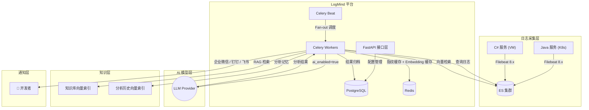
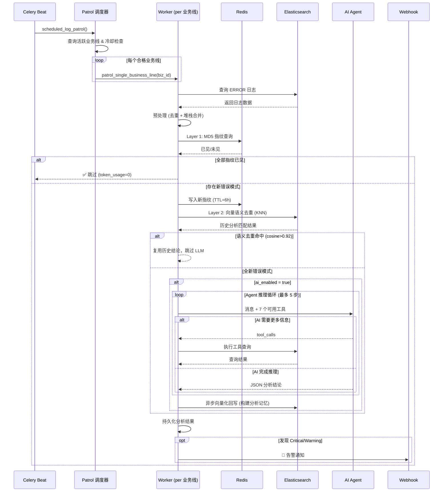

<p align="right">
  <a href="README.md">🇨🇳 中文</a> | <a href="README_EN.md">🇺🇸 English</a>
</p>

<div align="center">
  <br/>
  <h1>🧠 LogMind</h1>
  <p><b>智能日志分析与告警平台</b></p>
  <p>AI-Powered Log Analysis & Alert Platform for Cloud-Native and Hybrid Infrastructure</p>

  <p>
    <a href="https://python.org"></a>
    <a href="https://fastapi.tiangolo.com"></a>
    
    
    
    <a href="LICENSE"></a>
  </p>
</div>

<br/>

> LogMind 对接企业已有的 ELK 日志基础设施，通过 AI 大模型自动识别错误模式、追踪异常根因、生成修复建议，并将告警推送至企业微信 / 钉钉 / 飞书。  
> 支持 **Java (K8s)** 和 **C# (.NET/VM)** 混合架构，提供灵活的 **AI 开关**：开启时进行深度智能分析，关闭时自动降级为轻量化异常通知。  
> 内置 **AI Agent 自主推理**：AI 可主动调用 ES 工具进行多步查询，像真正的 SRE 一样逐步缩小排查范围，而不仅仅是分析一次性日志快照。  
> 内置 **三层智能去重**：MD5 指纹 → 向量语义匹配 → 分析记忆闭环，最大程度减少重复 LLM 调用，节省 40-60% Token 成本。

---

### 📑 目录

- [核心能力](#-核心能力)
- [架构设计](#-架构设计)
- [功能矩阵](#-功能矩阵)
- [成本控制配置](#-成本控制配置)
- [快速开始](#-快速开始)
- [业务线配置指南](#-业务线配置指南)
- [通知模板说明](#-通知模板说明)
- [API 接口参考](#-api-接口参考)
- [项目结构](#-项目结构)
- [未来路标](#-未来路标)
- [参与贡献](#-参与贡献)
- [开源协议](#-开源协议)

---

## ✨ 核心能力

### 🔌 无缝对接企业 ELK

直接读取已有 Elasticsearch 中的 Filebeat 日志，无需改造日志采集链路。支持 Data Stream 索引（`.ds-*`）和传统索引。

### 🤖 AI 大模型弹性分析

- 开箱即用对接 OpenAI / Claude / Gemini / DeepSeek / 内网私有模型
- **AI 开关**：按业务线独立控制，关闭即零 Token 消耗
- AI 异常自动降级：模型故障时自动切换为原始日志通知，告警不丢失

### 🧠 AI Agent 自主推理（多步工具调用）

区别于传统「一次性 Prompt-Response」模式，LogMind 内置 Agent 推理循环。AI 拥有主动查询能力，可在一次分析中发起多步工具调用：

| Agent Tool | 作用 |
|-----------|------|
| `search_logs` | 自由构造条件搜索更多日志（关键词、级别、域名、时间段） |
| `get_log_context` | 查看某个时间点前后 N 分钟的完整上下文 |
| `count_error_patterns` | 按异常类型 / 域名 / 时间段聚合统计错误频率 |
| `list_available_indices` | 发现其他相关服务的 ES 索引 |
| `search_knowledge_base`| 根据相关性智能检索内部知识库、SOP 和历史故障处理手册 |
| `search_similar_incidents`| 🆕 搜索历史上语义相似的 AI 分析记录，参考过去的根因结论 |
| `search_cross_service_logs`| 🆕 跨业务线搜索其他服务的错误日志，关联上下游故障 |

**典型推理链**：  
发现大量连接超时 → 调用 `search_similar_incidents` 查看历史是否有相似事件 → 调用 `search_cross_service_logs` 检查上游服务是否有异常 → 调用 `count_error_patterns` 确认频率趋势 → 调用 `search_knowledge_base` 查阅 SOP → 给出根因结论和修复建议。

### 🔍 智能日志质量过滤（误报消除）

日志采集系统（Filebeat）可能因文件级别映射将 INFO 日志混入 ERROR 查询结果。LogMind 通过 **三层防护** 消除误报：

1. **ES 查询层**：使用精准短语匹配 `[ERROR]`、`] ERROR `、`Exception:` 替代散列关键词搜索，避免 JSON 响应中 `"error":""` 字段名被误匹配
2. **Pipeline 层**：`LogQualityFilterStage` 对每条日志做消息级别二次验证 + 业务噪声检测 + 虚假 ERROR 检测
   - `gy.filetype=error.log` 但 message 解析为 `[INFO]` → 过滤
   - `{"status":true,"success":true}` 纯业务成功响应 → 过滤
   - 🆕 `log.error("限制缓存 key:{},获取结果:{}")` 无异常指标的 ERROR 日志 → 过滤（虚假 ERROR 检测）
   - 过滤后无有效错误 → 跳过分析和通知，零 Token 消耗

### 🔐 敏感数据保护（LLM 安全屏障）

日志中常见的敏感信息（Token、手机号、账号、身份证等）在发送给外部 LLM 之前自动脱敏，基于**通用数据格式匹配**，所有站点自动覆盖无需逐站配置：

| 数据类型 | 脱敏效果 | 匹配方式 |
|---------|---------|--------|
| 手机号 | `18135826` → `181****0826` | 格式检测 + KV 键名 |
| Token/UUID | `a97f57ef-9889-...` → `a97f****c4f1` | 44 个通用敏感键名 |
| 账号 | `wyf613` → `wyf****9613` | KV 键名 (`account`, `userId`) |
| 身份证 | `11010111234` → `110101********1234` | 18 位格式检测 |
| 邮箱 | `admin@.cn` → `adm****@.cn` | 邮箱格式检测 |
| 错误堆栈 | `NullPointerException: null` | ✅ **完整保留** |

脱敏在两个层级同时生效：Pipeline 主流程（所有日志）+ Agent 工具返回结果（上下文查询）。

### 🧬 四层智能成本控制

LogMind 通过四层递进式机制，最大程度降低无效分析和 Token 消耗：

```
                          ┌─────────────────────┐
     ES 查询结果 ─────────▶│ Layer 0: 质量过滤    │  INFO/噪声/虚假ERROR → 丢弃
                           │ 三层验证+脱敏         │
                          └────────┬────────────┘
                                   │ 有效错误
                          ┌────────▼────────────┐
                          │ Layer 1: MD5 指纹    │  字面完全相同 → 跳过 (零成本)
                          │ Redis 缓存, TTL=6h   │
                          └────────┬────────────┘
                                   │ 未命中
                          ┌────────▼────────────┐
                          │ Layer 2: 向量语义匹配 │  堆栈相似 → 复用历史结论 (跳过 LLM)
                          │ ES KNN, cosine>0.92  │
                          └────────┬────────────┘
                                   │ 未命中
                          ┌────────▼────────────┐
                          │ Layer 3: Agent 分析   │  全新错误 → 完整 AI 推理
                          │ 分析后自动向量化回写   │  ──▶ 构建"分析记忆"供下次命中
                          └─────────────────────┘
```

| 层级 | 机制 | 成本 | 效果 |
|------|------|------|------|
| **Layer 0** | 消息级别验证 + 噪声检测 + 虚假 ERROR + 脱敏 | 零 | 消除 INFO 误报 + 过滤滥用 log.error() |
| **Layer 1** | Redis MD5 指纹缓存 | 零 API 调用 | 跳过完全相同的错误 |
| **Layer 2** | ES 向量 KNN 搜索 | 1 次 Embedding | 跳过语义相似的错误 |
| **Layer 3** | 完整 Agent 推理 | 完整 LLM 调用 | 全新错误深度分析 |

> **实测效果**：消除 100% INFO 日志误报，过滤滥用 `log.error()` 的常规日志，配合向量去重可减少 **40-60%** 重复 LLM 调用。

### 🎯 告警优先级决策引擎 (P0/P1/P2)

结合多维度信号自动计算告警优先级，避免 “所有告警都是紧急” 的报警疲劳：

| 维度 | 权重 | 说明 |
|------|------|------|
| AI 严重度 | 30% | critical=30, warning=15, info=5 |
| 错误频率异常 | 25% | 当前频率 / 基线频率，超过 5x 满分 |
| 业务线权重 | 25% | 1-10 可配置 (10=核心收入线) |
| 核心路径 | 10% | 登录/支付/注册等不可降级路径 |
| AI 置信度 | 10% | 分析结果可信度 |
| 🆕 历史自适应 | ±15 | 从告警确认率 + 反馈评分自动学习 |

**优先级映射**：

| 优先级 | 评分 | 行为 |
|---------|------|------|
| 🔴 **P0** | ≥70 | 立即通知，夜间可唤醒値班 |
| 🟡 **P1** | ≥40 | 正常通知，夜间根据策略延迟 |
| 🟢 **P2** | <40 | 静默，汇入日报 |
| 🔇 **抑制** | — | 🆕 已知噪音，自动抑制仅入日报 |

**夜间不打扰策略**：每个业务线可独立配置：
- `always`：任何级别立即通知
- `p0_only`：夜间仅 P0 通知，P1/P2 延迟到早上
- `silent`：完全静默，全部延迟到早上

### 📚 AI 自动沉淀 — 已知问题库

类似 Sentry 的 Issue Grouping，但 AI 增强版。每次 AI 分析完成后，结论自动向量化存入 ES，形成“已知问题库”：

| 能力 | Sentry | LogMind |
|------|--------|--------|
| 指纹匹配 | Hash 精确匹配 | 🌟 **向量语义匹配** (容忍行号/参数变化) |
| 匹配结果 | "已知" 标签 | 🌟 **附带 AI 根因+修复建议** |
| 回归检测 | ✅ Regression | ✅ 回归 → 自动升级 P0 |
| 反馈闭环 | ✅ Resolve/Ignore | ✅ +1验证(TTL永久) / -1差评(排除) |
| 自动续期 | ✖ | ✅ 每次命中自动刷新 TTL |

**工作流程**：
```
新错误 → 向量匹配 → Miss → AI 分析 → 结论自动沉淀 → 🆕 首次发现
同类错误 → 向量匹配 → Hit → 复用结论 (跳过 LLM) → 📋 已知问题|第N次
回归 Bug → 向量匹配 → Hit(resolved) → 强制重新分析 → 🔄 回归|自动P0
反馈+1 → 结论标记“已验证” → TTL 延长到 365 天
反馈-1 → 结论标记“不准确” → 从 KNN 匹配中排除
```

内置知识库管理，支持上传 SOP 文档、历史故障报告、排查手册等。文档自动分块、向量化，存储在 ES 8.x `dense_vector` 索引中。Agent 可在分析过程中按需检索相关知识。

- **完整 CRUD API**：创建知识库 → 上传文档 → 异步索引 → Agent 检索
- **ES 原生向量存储**：无需外部向量数据库
- **Embedding 缓存**：热点查询 Redis 缓存，减少 API 调用

### 🧬 AI 自进化学习系统

LogMind 不仅仅是一个分析工具 — 它是一个**自我进化**的智能运维系统。每次分析都让系统变得更聪明：

```
┌─────────────────────────────────────────────────────────────────────┐
│                    AI 自进化闭环架构                                 │
├─────────────────────────────────────────────────────────────────────┤
│                                                                     │
│  ┌─── 输入学习 ──────┐  ┌─── 分析学习 ──────┐  ┌─── 决策学习 ──────┐│
│  │ AI 发现新错误信号  │  │ 历史结论注入      │  │ 告警优先级自适应  ││
│  │ → 自动扩展采集范围 │  │ Prompt → 经验规则 │  │ → 从行为自动调权  ││
│  │ (error_signals)    │  │ (business_profile)│  │ (priority_learning)│
│  └──────┬─────────────┘  └──────┬──────────┘  └──────┬──────────┘│
│         │                       │                     │            │
│         ▼                       ▼                     ▼            │
│  ┌─────────────────── 反馈修正层 ──────────────────────────┐       │
│  │  用户 +1 → 信号/规则置信度保持, 画像标记已验证          │       │
│  │  用户 -1 → 信号/规则置信度÷2, 向量排除, 缓存失效       │       │
│  │  5次未确认 → 自动判定为噪音, 抑制通知仅入日报          │       │
│  └──────────────────────────────────────────────────────────┘       │
│                                                                     │
└─────────────────────────────────────────────────────────────────────┘
```

| 学习维度 | 机制 | 效果 |
|---------|------|------|
| **输入学习** | AI 分析结果 → 提取 `error_signals` → 存入 ES → 扩展 Channel B 采集 | 自动发现新的故障关键词 |
| **分析学习** | 历史分析 → 业务线画像 → 注入 Prompt + 经验规则库 | AI "记住" 每个服务的历史问题 |
| **决策学习** | 告警确认率 + 反馈评分 → 优先级分数自动调整 | 减少告警疲劳 |
| **负向修正** | score=-1 → 信号降级 + 规则降级 + 画像刷新 + 向量排除 | 防止错误判断持续传播 |
| **疲劳抑制** | 已知问题 status=ignored / 多次未确认 → 自动静默 | 运维不再被噪音打扰 |

### 🌐 多语言日志智能解析

| 语言 | 日志级别提取 | 堆栈检测 | 部署环境 |
|------|------------|---------|---------| 
| **Java** | `gy.filetype` 映射 (error.log / info.log) | `at pkg.Class(File.java:123)` + `Caused by:` | K8s Pod |
| **C#** | message NLog 正则 (`时间 [线程] ERROR 类名`) | `at NS.Class() in File.cs:line N` | Windows VM |
| **Python** | message 关键词 | `Traceback` + `File "xxx", line N` | 通用 |
| **Go** | message 关键词 | `goroutine` + `panic` | K8s / VM |

### 📨 模板化 Webhook 通知

三种告警模板自动匹配场景，支持企业微信 / 钉钉 / 飞书 webhook 自动适配：

| 模板 | 触发场景 | 包含信息 |
|------|---------|---------| 
| ⚠️ 日志异常告警 | AI 关闭，检测到错误日志 | 业务线、站点、环境、语言、日志数、异常摘要 |
| 🔴 AI 分析告警 | AI 分析发现 Critical 问题 | 告警级别、AI 结论、影响范围、任务 ID |
| 🛑 AI 流程异常 | AI 模型调用失败 | 错误信息、故障原因 + 降级通知 |

### 🏢 企业级多租户

天然基于 **租户 → 业务线** 层级隔离。每个业务线独立配置 ES 索引、开发语言、AI 开关、webhook 地址、告警阈值。

### ⚡ 多业务线并行巡检

采用 **Fan-out 调度模式**：Celery Beat 触发调度器 → 为每个业务线创建独立 Worker 任务 → 真正并行执行。  
**单个业务线巡检失败不影响其他**，线性扩展 Worker 数量即可支撑更大规模。

---

## 🏗 架构设计

### 系统架构



### 分析流程



---

## 📋 功能矩阵

| 模块 | 功能 | 状态 |
|------|------|------|
| **日志接入** | Filebeat → ES 日志读取 | ✅ |
| | Data Stream 索引 (`.ds-*`) 支持 | ✅ |
| | 自定义 ES 索引模式 | ✅ |
| **日志解析** | Java `gy.filetype` 级别映射 | ✅ |
| | C# NLog/log4net 级别解析 | ✅ |
| | Java 堆栈异常合并 | ✅ |
| | C# .NET 堆栈异常合并 | ✅ |
| | Filebeat multiline 感知 | ✅ |
| **AI 分析** | 多模型支持 (OpenAI/Claude/DeepSeek...) | ✅ |
| | 配置化 Prompt 模板 (YAML + DB) | ✅ |
| | Java / C# 双语言堆栈分析 Prompt | ✅ |
| | 业务线级 AI 开关 | ✅ |
| | AI 失败降级通知 | ✅ |
| | AI Agent 多步推理 (Function Calling) | ✅ |
| | Agent ES 工具 (7 个工具) | ✅ |
| | 🆕 跨业务线关联分析 | ✅ |
| **智能过滤** | 🆕 Layer 0: 日志质量过滤 (消息级别验证) | ✅ |
| | 🆕 Layer 0: 业务噪声检测 (JSON 成功响应) | ✅ |
| | 🆕 Layer 0: 虚假 ERROR 检测 (log.error 滥用过滤) | ✅ |
| **敏感数据保护** | 🆕 通用敏感数据脱敏引擎 (LLM 发送前清洗) | ✅ |
| | 🆕 44 个通用敏感键名 + 5 种数据格式自动识别 | ✅ |
| | 🆕 Pipeline + Agent 工具双层脱敏 | ✅ |
| **智能去重** | Layer 1: Redis MD5 错误指纹 | ✅ |
| | Layer 2: 向量语义匹配 (ES KNN) | ✅ |
| | Layer 3: 分析记忆自动回写 | ✅ |
| | Embedding Redis 缓存 | ✅ |
| **已知问题库** | 🆕 问题状态管理 (open/resolved/ignored) | ✅ |
| | 🆕 命中计数 + 自动续期 (TTL 7天→刷新) | ✅ |
| | 🆕 回归检测 (resolved再现 → P0 升级) | ✅ |
| | 🆕 反馈联动 (+1验证/TTL365天, -1排除匹配) | ✅ |
| | 🆕 通知标签 (🆕首次/🔄回归/📋已知) | ✅ |
| **RAG 知识库** | 文本文档分块 (Chunking) | ✅ |
| | ES 8.x `dense_vector` 原生向量存储 | ✅ |
| | Agent 智能 KNN 检索 (按需唤醒) | ✅ |
| | 🆕 知识库 CRUD 管理 API | ✅ |
| | 🆕 文档上传 + 异步索引 | ✅ |
| **告警通知** | 企业微信 / 钉钉 / 飞书 Webhook | ✅ |
| | 模板化通知 (3 种场景) | ✅ |
| | 业务线独立 Webhook URL | ✅ |
| | 🆕 告警智能聚合 (Redis 窗口去重) | ✅ |
| | 🆕 每日/每周分析报告推送 | ✅ |
| **优先级决策** | 🆕 5 维加权评分 (P0/P1/P2 自动分级) | ✅ |
| | 🆕 夜间不打扰策略 (always/p0_only/silent) | ✅ |
| | 🆕 业务线权重配置 (1-10) + 核心路径标记 | ✅ |
| | 🆕 自动修复 Runbook 框架 (预留) | ⚠️ 阶段 B |
| **自学习** | 🆕 分析结论反馈 API (✅有帮助 / ❌不准确) | ✅ |
| | 🆕 AI 信号自学习 (error_signals → Channel B 扩展) | ✅ |
| | 🆕 业务线智能画像 (历史结论注入 Prompt) | ✅ |
| | 🆕 经验规则库 (experience_rule → Prompt 进化) | ✅ |
| | 🆕 负向反馈学习 (score=-1 → 信号/规则/画像四重降级) | ✅ |
| | 🆕 告警优先级自适应 (ack_rate + feedback → 自动调权) | ✅ |
| | 🆕 告警疲劳自抑制 (已知噪音/多次未确认 → 静默) | ✅ |
| **平台能力** | 多租户隔离 | ✅ |
| | JWT 认证 + 角色鉴权 | ✅ |
| | API Key Fernet 加密存储 | ✅ |
| | Celery Beat 定时巡检 | ✅ |
| | Fan-out 多业务线并行巡检 | ✅ |
| | 巡检冷却控制 | ✅ |
| | 🆕 Agent 安全保护 (Token上限+连续失败退出) | ✅ |
| | 🆕 Celery 任务超时保护 (5分钟) | ✅ |

---

## 💰 成本控制配置

LogMind 内置多层 Token 消耗控制机制，通过 `.env` 配置：

| 环境变量 | 默认值 | 说明 |
|---------|--------|------|
| `ANALYSIS_MAX_LOGS_PER_TASK` | `500` | 单次分析最大抓取日志数 |
| `ANALYSIS_COOLDOWN_MINUTES` | `30` | 同一业务线两次自动巡检最小间隔（分钟） |
| `ANALYSIS_FINGERPRINT_ENABLED` | `true` | 是否启用 Layer 1 MD5 指纹去重 |
| `ANALYSIS_FINGERPRINT_TTL_HOURS` | `6` | MD5 指纹缓存 TTL（小时） |
| `ANALYSIS_SEMANTIC_DEDUP_ENABLED` | `true` | 🆕 是否启用 Layer 2 向量语义去重 |
| `ANALYSIS_SEMANTIC_DEDUP_THRESHOLD` | `0.92` | 🆕 语义匹配阈值 (0-1, 越高越严格) |
| `ANALYSIS_SEMANTIC_DEDUP_TTL_HOURS` | `24` | 🆕 历史分析结论有效期 |
| `ANALYSIS_EMBEDDING_CACHE_TTL_SECONDS` | `3600` | 🆕 Embedding 向量 Redis 缓存 TTL |
| `ANALYSIS_AGENT_ENABLED` | `true` | 是否启用 Agent 多步推理 |
| `ANALYSIS_AGENT_MAX_STEPS` | `5` | Agent 最大工具调用步数 |
| `ANALYSIS_AGENT_MAX_TOKENS` | `30000` | 🆕 Agent 单次分析 Token 消耗上限 |
| `ANALYSIS_TASK_TIMEOUT` | `300` | 🆕 Celery 任务软超时 (秒) |

> **关闭 Agent 不影响分析功能**，只影响分析深度。设置 `ANALYSIS_AGENT_ENABLED=false` 可立即降低 Token 消耗 30-50%。  
> **向量语义去重**可单独开关，不影响 MD5 指纹去重。两层级联兼顾速度和精度。

---

## 🚀 快速开始

### 环境要求

| 组件 | 版本要求 |
|------|---------| 
| Python | ≥ 3.13 |
| PostgreSQL / MySQL | 任选其一 |
| Redis | ≥ 6.0 |
| Elasticsearch | ≥ 8.x（已部署，含 Filebeat 日志数据） |

### 源码部署

```bash
# 1. 克隆项目
git clone https://github.com/leeeway/LogMind.git
cd LogMind

# 2. 创建虚拟环境
python3 -m venv .venv
source .venv/bin/activate

# 3. 安装依赖
pip install -r requirements.txt

# 4. 配置环境变量
cp .env.example .env
# 编辑 .env，配置数据库、ES、Redis 连接信息

# 5. 初始化数据库 + 播种默认数据
python -m logmind.scripts.seed_prompts

# 6. 启动服务
make run      # FastAPI 主服务 (端口 8000)
make worker   # Celery Worker (新终端)
make beat     # Celery Beat 调度器 (新终端)
```

### Docker Compose 部署

```bash
# 一键启动（含 PostgreSQL + Redis）
docker-compose --env-file .env.production up -d --build
```

### 首次配置

1. **登录获取 Token**
   ```bash
   curl -X POST http://127.0.0.1:8000/api/v1/auth/login \
     -H "Content-Type: application/json" \
     -d '{"username": "admin", "password": "logmind2024!"}'
   ```

2. **注册 AI 模型提供商**（可选，仅 `ai_enabled=true` 时需要）
   ```bash
   curl -X POST http://127.0.0.1:8000/api/v1/providers \
     -H "Authorization: Bearer <TOKEN>" \
     -H "Content-Type: application/json" \
     -d '{
       "provider_type": "openai",
       "name": "主分析引擎",
       "api_base_url": "https://api.openai.com/v1",
       "api_key": "sk-xxx",
       "default_model": "gpt-4o",
       "priority": 1
     }'
   ```

3. **创建业务线** → 见下一节

---

## ⚙️ 业务线配置指南

业务线是 LogMind 的核心配置单元。每个业务线对应一组 ES 索引，独立控制日志解析策略、AI 开关和告警通道。

### Java 服务（K8s 部署 + AI 分析）

```json
{
  "name": "tong-kernel",
  "description": "通行证内核服务",
  "es_index_pattern": "master-stage-tong-kernel.cn*",
  "severity_threshold": "error",
  "language": "java",
  "ai_enabled": true,
  "webhook_url": "https://qyapi.weixin.qq.com/cgi-bin/webhook/send?key=xxx"
}
```

### C# 服务（Windows VM + 仅通知）

```json
{
  "name": "interface-security",
  "description": "安全接口服务 (C#)",
  "es_index_pattern": "master-interface.security.cn*",
  "severity_threshold": "error",
  "language": "csharp",
  "ai_enabled": false,
  "webhook_url": "https://qyapi.weixin.qq.com/cgi-bin/webhook/send?key=yyy"
}
```

### 配置字段说明

| 字段 | 类型 | 必填 | 说明 |
|------|------|------|------|
| `name` | string | ✅ | 业务线名称 |
| `es_index_pattern` | string | ✅ | ES 索引模式，支持通配符。多个用逗号分隔 |
| `severity_threshold` | string | — | 告警阈值：`debug` / `info` / `warning` / `error` / `critical` |
| `language` | string | — | 开发语言：`java` / `csharp` / `python` / `go` / `other`。决定日志解析策略 |
| `ai_enabled` | boolean | — | 大模型开关。`false` 时跳过 AI 推理，直接发送异常日志通知 |
| `webhook_url` | string | — | 业务线专属 webhook URL。为空时使用全局配置 |
| `field_mapping` | object | — | 自定义字段映射（高级用法） |

---

## 📨 通知模板说明

### AI 关闭 — 日志异常告警

当 `ai_enabled=false` 且检测到错误日志时，自动推送：

```
## ⚠️ 日志异常告警

**业务线**: interface-security
**站点**: interface.security.cn
**语言**: C#
**时间范围**: 2026-04-13 22:00 ~ 22:30
**异常日志数**: 15 条

---

**异常摘要**:
2026-04-13 19:09:56,856 [155] ERROR .Core.DBUtility.DataHelper
- SqlException: Timeout expired...

---
> 请及时排查处理。登录 LogMind 平台查看完整日志。
```

### AI 开启 — AI 分析告警

当 AI 分析发现 Critical 级别问题时推送：

```
## 🔴 LogMind AI 分析告警

**告警级别**: CRITICAL
**业务线**: tong-kernel
**站点**: stage-tong-kernel.cn (正式环境)
**分析日志数**: 23 条

---

**AI 分析结论**:
1. NullPointerException 根因：cn.tong.filter.ConvertToHumpFilter
   第 96 行 phoneToken 参数未做空值校验...

---
> 请及时处理。登录 LogMind 平台查看完整分析报告。
```

### AI 异常降级 — 流程异常通知

当 AI 模型调用失败（超时 / 配额 / Key 过期）时：

```
## 🛑 AI 分析流程异常

**业务线**: tong-kernel
**站点**: stage-tong-kernel.cn

**错误信息**: API Error: quota exceeded

---
> AI 模型调用异常，请检查模型配置和 API Key。
```

随后自动降级发送原始日志摘要通知。

---

## 🔌 API 接口参考

完整 Swagger 文档：`http://127.0.0.1:8000/docs`

### 核心接口

| 方法 | 路径 | 说明 |
|------|------|------|
| `POST` | `/api/v1/auth/login` | 登录获取 JWT Token |
| `POST` | `/api/v1/business-lines` | 创建业务线 |
| `PUT` | `/api/v1/business-lines/{id}` | 更新业务线（可单独切换 AI 开关） |
| `POST` | `/api/v1/analysis/tasks` | 手动触发分析任务 |
| `GET` | `/api/v1/analysis/tasks/{id}` | 获取分析任务结果 |
| `PUT` | `/api/v1/analysis/results/{id}/feedback` | 🆕 提交分析结论反馈 (自学习) |
| `POST` | `/api/v1/providers` | 注册 AI 模型提供商 |
| `POST` | `/api/v1/alerts/rules` | 创建告警规则 |
| `GET` | `/api/v1/alerts/history` | 查看告警历史 |
| `GET` | `/api/v1/logs/search` | 搜索 ES 日志 |
| `GET` | `/api/v1/logs/stats` | 日志统计聚合 |
| `GET` | `/api/v1/logs/indices` | 列出 ES 索引 |

### 🆕 知识库管理 API

| 方法 | 路径 | 说明 |
|------|------|------|
| `POST` | `/api/v1/knowledge-base` | 创建知识库 |
| `GET` | `/api/v1/knowledge-base` | 列出知识库 |
| `GET` | `/api/v1/knowledge-base/{id}` | 查看知识库详情含文档列表 |
| `PUT` | `/api/v1/knowledge-base/{id}` | 更新知识库配置 |
| `DELETE` | `/api/v1/knowledge-base/{id}` | 删除知识库及其文档 |
| `POST` | `/api/v1/knowledge-base/{id}/documents` | 上传文档（文本内容） |
| `GET` | `/api/v1/knowledge-base/{id}/documents` | 列出知识库文档 |
| `DELETE` | `/api/v1/knowledge-base/{id}/documents/{doc_id}` | 删除文档 |

### 手动触发分析

```bash
curl -X POST "http://127.0.0.1:8000/api/v1/analysis/tasks" \
  -H "Authorization: Bearer <TOKEN>" \
  -H "Content-Type: application/json" \
  -d '{
    "business_line_id": "<BUSINESS_LINE_ID>",
    "task_type": "manual",
    "time_from": "2026-04-13T14:00:00Z",
    "time_to": "2026-04-13T22:00:00Z"
  }'
```

### 动态切换 AI 开关

```bash
curl -X PUT "http://127.0.0.1:8000/api/v1/business-lines/<ID>" \
  -H "Authorization: Bearer <TOKEN>" \
  -H "Content-Type: application/json" \
  -d '{"ai_enabled": false}'
```

### 🆕 上传知识库文档

```bash
curl -X POST "http://127.0.0.1:8000/api/v1/knowledge-base/<KB_ID>/documents" \
  -H "Authorization: Bearer <TOKEN>" \
  -H "Content-Type: application/json" \
  -d '{
    "filename": "redis-troubleshooting.md",
    "content": "# Redis 连接池故障排查指南\n\n## 现象\n连接池耗尽时..."
  }'
```

---

## 📁 项目结构

```
LogMind/
├── src/logmind/
│   ├── core/                    # 基础设施层
│   │   ├── config.py            # Pydantic 配置管理
│   │   ├── database.py          # SQLAlchemy 异步引擎
│   │   ├── elasticsearch.py     # ES 客户端
│   │   ├── redis.py             # Redis 客户端
│   │   ├── celery_app.py        # Celery 配置 + Beat 调度
│   │   ├── security.py          # JWT + Fernet 加密
│   │   └── dependencies.py      # FastAPI 依赖注入
│   ├── domain/                  # 业务领域层 (DDD)
│   │   ├── tenant/              # 租户 + 用户 + 业务线
│   │   ├── log/                 # ES 日志查询、解析与向量搜索
│   │   ├── analysis/            # AI 分析 Pipeline
│   │   │   ├── pipeline.py      # 10 阶段流水线 (含三层质量过滤 + PriorityDecisionStage)
│   │   │   ├── agent_stage.py   # AI Agent 多步推理 Stage (含安全保护)
│   │   │   ├── agent_tools.py   # 7 个 Agent 工具 (Function Calling + 脱敏)
│   │   │   ├── sensitive_masker.py # 🆕 通用敏感数据脱敏引擎
│   │   │   ├── priority_engine.py  # P0/P1/P2 优先级决策引擎
│   │   │   ├── fingerprint_stage.py # Layer 1: MD5 指纹去重
│   │   │   ├── semantic_dedup.py    # Layer 2: 向量语义去重
│   │   │   ├── analysis_indexer.py  # Layer 3: 分析结论自动回写
│   │   │   ├── business_profile.py   # 🆕 业务线智能画像 + 经验规则库
│   │   │   ├── priority_learning.py  # 🆕 优先级自适应 + 疲劳抑制
│   │   │   └── tasks.py         # Celery 任务入口
│   │   ├── alert/               # 告警规则 + 并行巡检调度
│   │   ├── provider/            # AI 模型提供商管理
│   │   │   └── adapters/        # OpenAI/Claude/Gemini/DeepSeek/Ollama
│   │   ├── prompt/              # Prompt 模板引擎
│   │   ├── rag/                 # 🆕 RAG 知识库 (ES 向量检索 + 管理 API)
│   │   ├── log/
│   │   │   ├── error_signals.py  # 🆕 三层信号注册表 (静态+学习+合并)
│   │   │   └── service.py       # ES 查询服务 (含 Channel B)
│   │   └── dashboard/           # 仪表盘统计
│   ├── shared/                  # 通用组件
│   └── main.py                  # FastAPI 入口
├── configs/prompts/             # 内置 Prompt 模板 (YAML)
│   ├── log_analysis.yaml        # 通用日志分析模板
│   └── stack_trace_analysis.yaml # 堆栈异常分析模板
├── migrations/                  # 数据库迁移脚本
├── deploy/                      # 部署配置
├── docker-compose.yml           # Docker Compose 编排
├── Makefile                     # 常用命令
└── .env.example                 # 环境变量模板
```

---

## 🎯 未来路标 (Roadmap)

### v1.0 — 基础版 ✅

- [x] 多租户 + 业务线隔离架构
- [x] Java / C# 双语言日志解析引擎
- [x] 多模型 AI Provider 管理 (OpenAI / DeepSeek / 内网模型)
- [x] Celery 分布式定时巡检 + 冷却控制
- [x] 业务线级 AI 开关 + AI 异常降级通知
- [x] 模板化 Webhook 多平台推送
- [x] Prompt 模板化管理 (YAML + DB 双源)

### v1.1 — Agent 智能化 ✅

- [x] AI Agent 多步推理 (Function Calling + ES 工具)
- [x] Redis 错误指纹去重 (Layer 1)
- [x] RAG 知识库检索 (ES 原生向量 + Agent Tool)

### v1.2 — 智能去重 + 高并发扩展 

- [x] 向量语义去重 (Layer 2 — ES KNN)
- [x] 分析记忆自动回写 (Layer 3 — 闭环)
- [x] Embedding Redis 缓存
- [x] Agent 历史事件搜索工具
- [x] Agent 跨业务线关联分析
- [x] Fan-out 多业务线并行巡检
- [x] Knowledge Base 完整 CRUD API

### v1.3 — 安全加固 + 运维增强 ✅

- [x] Agent 循环安全加固 (连续失败退出 + Token 上限)
- [x] Celery 任务超时保护 (5 分钟)
- [x] 告警智能聚合 (Redis 窗口 5 分钟去重)
- [x] 每日/每周分析报告推送
- [x] 分析结论反馈 API (自学习闭环)

### v1.4 — 告警优先级决策引擎 ✅

- [x] 5 维加权评分 (AI严重度+频率+业务权重+核心路径+置信度)
- [x] P0/P1/P2 自动分级
- [x] 夜间不打扰策略 (always/p0_only/silent)
- [x] 业务线权重 + 核心路径配置
- [x] 告警消息带优先级标签

### v1.5 — AI 自动沉淀已知问题库 ✅

- [x] ES 向量索引扩展 (状态/命中数/反馈质量)
- [x] TTL 24h → 7 天 + 命中自动续期
- [x] 回归检测 (resolved 再现 → 强制重新分析 + P0 升级)
- [x] 反馈→向量库联动 (+1验证/TTL365天, -1排除匹配)
- [x] 通知标签 (🆕首次发现 / 🔄回归 / 📋已知问题)

### v1.6 — 可观测性增强 ✅

- [x] Pipeline 分阶段执行指标 (stage_metrics)
- [x] Agent 工具调用链建模 (AgentToolCall)
- [x] 执行追踪 API (`/api/v1/analysis/tasks/{id}/trace`)

### v1.7 — 稳定性修缮 ✅

- [x] cleanup 外键约束修复 (AgentToolCall → AnalysisResult → Task)
- [x] 告警聚合器 Redis 连接修复 (`get_redis_client()` 统一)
- [x] Redis 连接泄漏修复 (fingerprint_stage + semantic_dedup)
- [x] AI-off 路径 stage_metrics 持久化补全

### v1.8 — 安全加固 + 数据保护 ✅

- [x] 通用敏感数据脱敏引擎 (44 个键名 + 5 种格式，所有站点自动覆盖)
- [x] Pipeline 脱敏 + Agent 工具返回结果脱敏 (双层保护)
- [x] Agent 工具 LogService 单例统一 (消除 5 处实例化)
- [x] Agent `get_log_context` 添加 severity 过滤 (防止拉取 INFO/DEBUG)

### v1.9 — 生产日志兼容优化 ✅

- [x] C# 混合级别文件 (`sys.log.txt`) filetype 映射激活
- [x] 虚假 ERROR 检测 (log.error 滥用过滤)
- [x] 敏感字段补全 (account/userId/memberId — 来自真实生产日志)
- [x] 业务噪声检测增强 (中文成功响应模式)

### v2.0 — AI 自进化学习系统 ✅ ← 当前

- [x] 内容感知 Channel B 错误采集 (绕过 filetype 限制)
- [x] AI 信号自学习 (error_signals → ES → 反哺 ES 查询)
- [x] 经验规则库 (experience_rule → ES → Prompt 动态进化)
- [x] 业务线智能画像 (历史分析结论 + 规则 → Prompt 注入)
- [x] 负向反馈学习 (score=-1 → 信号/规则/画像/向量 四重降级)
- [x] 告警优先级自适应 (历史确认率 + 反馈评分 → 自动调权)
- [x] 告警疲劳自抑制 (已知问题 ignored / 多次未确认 → 静默)

### v2.1 — AI 深度进化 (规划中)

- [ ] 跨服务根因关联 (Service A 超时时自动检查 Service B 是否异常)
- [ ] 错误趋势预警 (error rate 加速增长时提前告警)
- [ ] Agent 工具策略自优化 (从 ToolCallRecord 学习最有效的工具链)
- [ ] 智能日志采样 (per-service 自适应采样策略)
- [ ] 分析质量自评估 (低质量分析自动重跑)

### v2.5 — 运维深度集成

- [ ] Web 管理界面 (Vue.js / React Dashboard)
- [ ] K8s Event 关联分析 + ConfigMap 变更追踪
- [ ] 部署系统联动：近期发布记录与错误关联
- [ ] 多 ES 集群联邦查询
- [ ] MCP 协议 Agent 工具解耦

### v3.0 — Auto-Remediation 自动自愈

- [ ] Agent 自治行动：`restart_pod`, `scale_deployment`
- [ ] 交互式审批修复：企微审批卡片 → 一键执行
- [ ] AI Fix PR 建议 (对接 GitLab/GitHub)
- [ ] 跨服务分布式链路追踪 (Trace) 关联
- [ ] Text-to-DSL 自然语言日志查询

---

## 🤝 参与贡献

LogMind 欢迎社区贡献！

1. **Fork** 本仓库
2. 创建特性分支 `git checkout -b feature/your-feature`
3. 遵循代码规范 `make lint && make format`
4. 提交更改 `git commit -m 'feat: add your feature'`
5. 推送分支 `git push origin feature/your-feature`
6. 提交 **Pull Request**

### 开发命令

```bash
make help       # 查看所有可用命令
make dev        # 安装开发依赖
make run        # 启动开发服务器
make worker     # 启动 Celery Worker
make beat       # 启动定时调度器
make test       # 运行测试
make lint       # 代码检查
make format     # 代码格式化
```

---

## 📜 开源协议

[MIT License](LICENSE) — 允许商业使用和私有化部署。

> 项目本身不对 AI 模型调用产生的费用和算力消耗提供任何担保。请参阅 LICENSE 了解完整条款。
