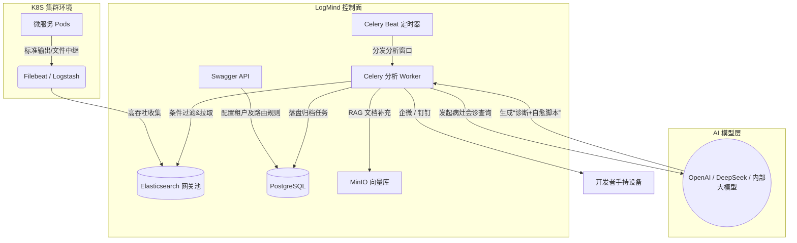
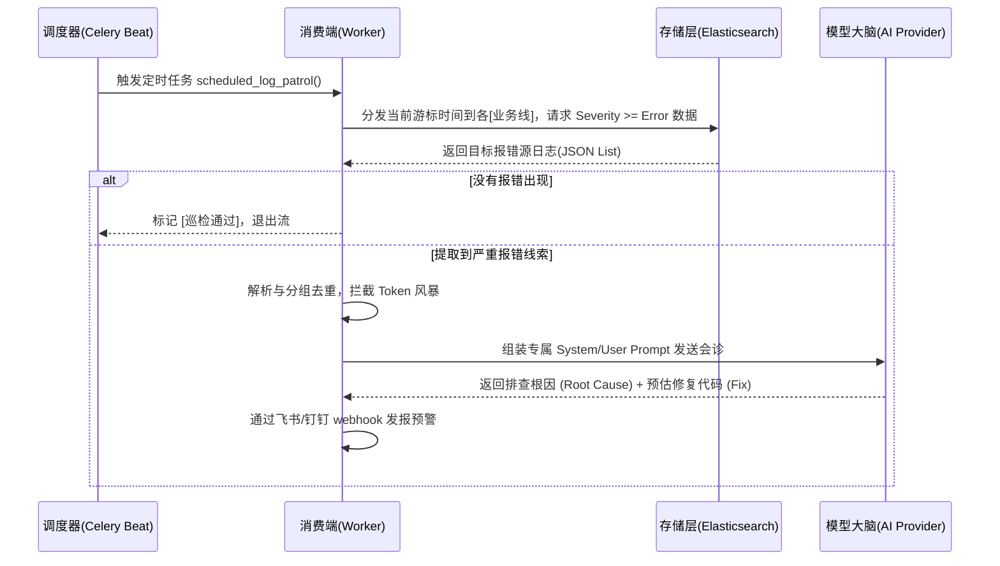

<div align="center">
  <br/>
  <h1>🧠 LogMind (智能日志中枢)</h1>
  <br/>

  <p><b>面向云原生环境的 AI 驱动日志审计、自动化错误诊断与故障自愈防线平台</b></p>

  <p>
    <a href="https://python.org"></a>
    <a href="https://fastapi.tiangolo.com"></a>
    <a href="https://www.sqlalchemy.org/"></a>
    <a href="https://docs.celeryq.dev/"></a>
    
    
    <a href="LICENSE"></a>
  </p>

  <p>
    随着云原生架构的扩展，传统的基于正则匹配和关键字堆砌的日志拦截规则已无法适应复杂微服务间的衍生报错。<br/>
    <b>LogMind</b> 作为统一日志网关与大型语言模型（LLMs）的桥梁，以异步分布式架构为您建立 24/7 永不休息的“资深 AI 运维专家”。
  </p>
</div>

<br/>

---

## 📑 目录 (Table of Contents)

- [✨ 核心特性 (Key Features)](#-核心特性-key-features)
- [🏗️ 架构设计 (Architecture)](#-架构设计-architecture)
  - [系统数据流拓扑](#1-系统数据流拓扑)
  - [自动巡检工作流 (Patrol Workflow)](#2-自动巡检工作流-patrol-workflow)
- [📦 安装指南 (Installation)](#-安装指南-installation)
  - [方式一：物理机/容器源码级部署 (开发推荐)](#方式一物理机容器源码级部署-开发推荐)
  - [方式二：Docker Compose 一键启动 (生产推荐)](#方式二docker-compose-一键启动-生产推荐)
- [🚀 最佳实践教程 (Quick Start)](#-最佳实践教程-quick-start)
  - [1. 申请鉴权 Token](#1-申请鉴权-token)
  - [2. 注册大模型驱动 (AI Providers)](#2-注册大模型驱动-ai-providers)
  - [3. 配置 K8S 日志流监听拦截](#3-配置-k8s-日志流监听拦截)
- [🔌 API 调用规范示例](#-api-调用规范示例)
- [🎯 未来路标 (Roadmap)](#-未来路标-roadmap)
- [🤝 参与贡献 (Contributing)](#-参与贡献-contributing)
- [📜 开源协议 (License)](#-开源协议-license)

---

## ✨ 核心特性 (Key Features)

* **🤖 大语言模型任意门**：提供开箱即用的 OpenAI、Claude 、Gemini 、DeepSeek 接入，同时支持高度兼容的内网私有化模型（只需暴露 Standard Rest 协议接口即可快速适配）。
* **🏢 企业级隔离池设计**：天然基于 **租户 (Tenant)** -> **业务线 (Business Line)** 的层级模型构建引擎。即便在千万级日志吞吐的 K8s 中，你依旧能为特殊的 `develop` 索引分发不同的系统超管和模型配额。
* **🧠 内置 RAG (检索增强生成)**：模型不知道内部框架代码逻辑？LogMind 支持将企业内部文档、Git 知识库和 SOP 处理手册预先向量化，AI 在给出根因判断前会自动进行近义上下文检索并对齐业务标准。
* **⏳ Celery 分布式滑动窗口**：通过 `异步消费 Worker + Time Patrol Scheduler`，解决 Filebeat 将日志推向 ES 时产生的物理吞吐延迟，永远不遗漏任何一条 FATAL 级别的黄金排错点。
* **🔐 端到端加密架构**：彻底杜绝大模型 API 密钥泄漏！所有的 `API Key` 刚进网关就会走动态推导密钥，做 Fernet + HMAC 防篡改高强度对称加密落库。

---

## 🏗️ 架构设计 (Architecture)

### 1. 系统数据流拓扑


### 2. 自动巡检工作流 (Patrol Workflow)

当后台 `make beat` 启动后，引擎的核心内部交互序列执行逻辑如下：



---

## 📦 安装指南 (Installation)

### 方式一：物理机/容器源码级部署 (开发推荐)

环境要求：`Python >= 3.13`，必须且仅支持使用虚拟环境管理。

```bash
# 1. 下载本仓库
git clone https://github.com/leeeway/LogMind
cd LogMind

# 2. 建立和激活隔离环境
python3 -m venv .venv
source .venv/bin/activate  # (Windows环境执行 .venv\Scripts\activate )

# 3. 安装所需依赖
pip install -r requirements.txt

# 4. 根据系统模版建立运行配置
cp .env.example .env     # (之后请进入 .env 根据你实际本机的 DB 输入正确账密)

# 5. 播种数据引擎（极为重要！）
python -m logmind.scripts.seed_prompts

# 6. 拉起 Uvicorn 主控服务，挂载在 8000 端口
uvicorn logmind.main:app --host 0.0.0.1 --port 8000 --reload
```

### 方式二：Docker Compose 一键启动 (生产推荐)

在企业环境内网部署中，您可以依赖附带的容器编排方案直接拉起应用包含的独立 Redis 与 Postgres 运行时环境：
```bash
docker-compose --env-file .env.production up -d --build
```
此时 Web 服务挂载宿主的 `8000` 端口，Celery 分布式端自动后台运作。

---

## 🚀 最佳实践教程 (Quick Start)

在此教程之前，确保服务已经拉起并能顺利访问 Web UI：[http://127.0.0.1:8000/docs](http://127.0.0.1:8000/docs)

### 1. 申请鉴权 Token
系统的全域操作必须受到 Auth 防御校验。
- 在页面找到 `POST /api/v1/auth/login`。
- Request Body 使用 初始化时终端生成的超管密码进行提交（默认超管账号为 `admin` / 密码依初始化日志而定）。
- 将响应得到的 `access_token` 数据拷贝。
- 移步至屏幕最右上角全局锁定按钮处 🔒，直接点击并粘贴！无需再补充 `Bearer` 等前缀。成功配置后发起调用即可通行。

### 2. 注册大模型驱动 (AI Providers)
调用 `POST /api/v1/providers`：
让系统具备智慧的第一步，是把任意私有化/公有化模型连接进来：

```json
{
  "provider_type": "openai",
  "name": "生产主力诊断引擎(GPT-4o)",
  "api_base_url": "https://api.openai.com/v1",
  "api_key": "YOUR_ENCRYPTED_SK",
  "default_model": "gpt-4o",
  "priority": 1,
  "rate_limit_rpm": 60,
  "is_active": true
}
```

### 3. 配置 K8S 日志流监听拦截
调用 `POST /api/v1/business-lines`：
告诉 LogMind 当前要守护的是哪个网关或子系统的数据源索引（如 `develop-server`）

```json
{
  "name": "develop 开发联调线",
  "description": "接管后端服务核心错误",
  "es_index_pattern": "develop-server*",
  "log_parse_config": {
     "timestamp_field": "@timestamp",
     "message_field": "message"
  },
  "default_filters": {
     "kubernetes.container.name": "app"
  },
  "severity_threshold": "error"
}
```

---

## 🔌 API 调用规范示例 

如果希望跳过 Swagger 使用脚本来发起智能分析任务并抓取最终解决报告，可以使用如下标准 cURL 实现：

**立刻对刚绑定的某个错误系统进行排查下发:**
```bash
curl -X POST "http://127.0.0.1:8000/api/v1/analysis/tasks" \
     -H "Authorization: Bearer <Your_Token>" \
     -H "Content-Type: application/json" \
     -d '{
       "business_line_id": "<上文业务线返回的UUID>",
       "task_type": "manual",
       "time_from": "2026-04-12T00:00:00Z",
       "time_to": "2026-04-12T08:00:00Z"
}'
```

**获取分析后的结论及诊断单结果:**
```bash
curl -X GET "http://127.0.0.1:8000/api/v1/analysis/tasks/<Task_ID>" \
     -H "Authorization: Bearer <Your_Token>"
```


---

## 🎯 未来路标 (Roadmap)

- [x] 完成核心基于租户的多 Elasticsearch 并发切分
- [x] OpenAPI 通用格式适配层 (SubAPI / DeepSeek / Ollama)
- [x] Celery Beat 分布式轮组重试窗口算法
- [ ] RAG 本地混合部署向量索引系统接入整合 (v0.2.x 目标)
- [ ] 针对异常根因全自动输出 Python / Go / Java 代码对应 Pull Request
- [ ] Webhook 扩展：支持 Teams, Slack 自适应排版推送

---

## 🤝 参与贡献 (Contributing)

LogMind 欢迎并拥抱所有的开发者反馈与社区代码合并！
如果你有意愿贡献或改进其基础设施层代码：
1. 请先 **Fork** 这个代码库。
2. 创建属于你的修复分支 (`git checkout -b feature/AmazingFeature`)。
3. 校验并严格按照 `black` 及 `isort` 提供代码格式。
4. 提交更改记录 (`git commit -m 'Add some AmazingFeature'`)。
5. 推送到您的分支 (`git push origin feature/AmazingFeature`)。
6. 并向项目主分支提交 **Pull Request**。

---

## 📜 开源协议 (License)

LogMind 作为一个前瞻性的平台，遵照且受控于完全免费的 **[MIT 许可协议](LICENSE)** 予以分发。

> **The MIT License (MIT)**
>
> 允许商业化与私有部署。项目本身不提供针对 AI 调用侧所消耗的实际资金池或算力的任何担保。详情点击并参阅 `LICENSE` 正文以了解免责与约束项。
