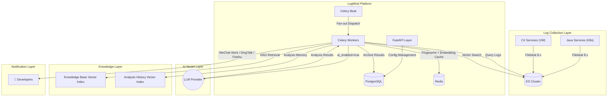
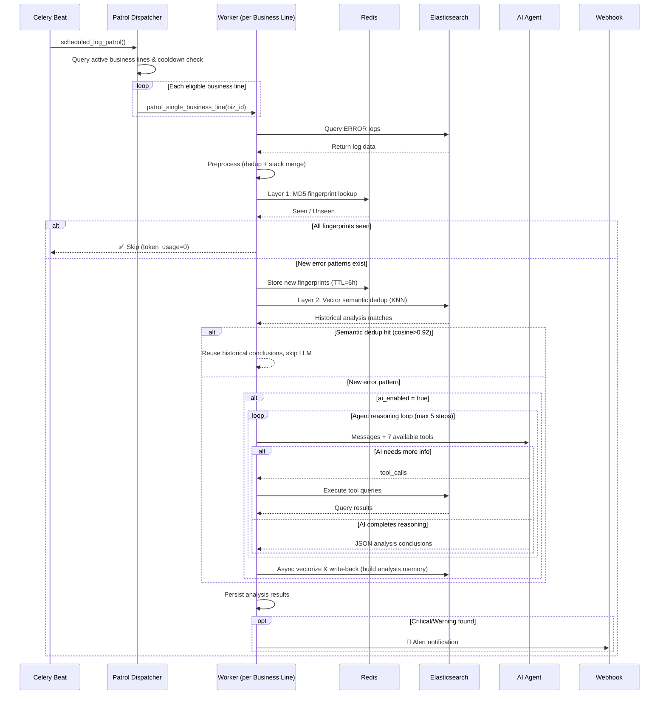

<p align="right">
  <a href="README.md">🇨🇳 中文</a> | <a href="README_EN.md">🇺🇸 English</a>
</p>

<div align="center">
  <br/>
  <h1>🧠 LogMind</h1>
  <p><b>Intelligent Log Analysis & Alert Platform</b></p>
  <p>AI-Powered Log Analysis & Alert Platform for Cloud-Native and Hybrid Infrastructure</p>

  <p>
    <a href="https://python.org"></a>
    <a href="https://fastapi.tiangolo.com"></a>
    
    
    
    <a href="LICENSE"></a>
  </p>
</div>

<br/>

> LogMind integrates with your existing ELK log infrastructure. It uses AI large language models to automatically identify error patterns, trace root causes, generate fix suggestions, and push alerts to WeChat Work / DingTalk / Feishu.  
> Supports **Java (K8s)** and **C# (.NET/VM)** hybrid architectures with a flexible **AI toggle**: deep intelligent analysis when enabled, lightweight error notifications when disabled.  
> Built-in **AI Agent autonomous reasoning**: AI can proactively invoke ES tools for multi-step queries, narrowing down issues step by step like a real SRE, not just analyzing a one-shot log snapshot.  
> Built-in **three-layer intelligent deduplication**: MD5 fingerprint → vector semantic matching → analysis memory loop, minimizing redundant LLM calls and saving 40-60% token costs.

---

### 📑 Table of Contents

- [Core Capabilities](#-core-capabilities)
- [Architecture](#-architecture)
- [Feature Matrix](#-feature-matrix)
- [Cost Control Configuration](#-cost-control-configuration)
- [Quick Start](#-quick-start)
- [Business Line Configuration Guide](#-business-line-configuration-guide)
- [Notification Templates](#-notification-templates)
- [API Reference](#-api-reference)
- [Agent Ecosystem Integration](#-agent-ecosystem-integration-mcp--hermes--openclaw)
- [Project Structure](#-project-structure)
- [Roadmap](#-roadmap)
- [Contributing](#-contributing)
- [License](#-license)

---

## ✨ Core Capabilities

### 🔌 Seamless ELK Integration

Reads directly from Filebeat logs in your existing Elasticsearch — no changes to the log collection pipeline required. Supports Data Stream indices (`.ds-*`) and traditional indices.

### 🤖 Elastic AI Model Analysis

- Out-of-the-box support for OpenAI / Claude / Gemini / DeepSeek / private models
- **AI toggle**: independently controlled per business line; disabled = zero token cost
- Auto-failover: when the model fails, automatically falls back to raw log notifications — no alerts lost

### 🧠 AI Agent Autonomous Reasoning (Multi-Step Tool Calling)

Unlike traditional "one-shot Prompt-Response" mode, LogMind features a built-in Agent reasoning loop. The AI has proactive query capabilities and can invoke multiple tools within a single analysis:

| Agent Tool | Purpose |
|-----------|---------|
| `search_logs` | Freely search for more logs (keywords, level, domain, time range) |
| `get_log_context` | View full context N minutes before/after a specific timestamp |
| `count_error_patterns` | Aggregate error frequency by exception type / domain / time range |
| `list_available_indices` | Discover related service ES indices |
| `search_knowledge_base` | Intelligently search internal knowledge base, SOPs, and incident playbooks |
| `search_similar_incidents` | 🆕 Search historically similar AI analyses for past root cause conclusions |
| `search_cross_service_logs` | 🆕 Cross-service log search to correlate upstream/downstream failures |

**Typical reasoning chain**:  
Detect connection timeouts → call `search_similar_incidents` to check history → call `search_cross_service_logs` to inspect upstream services → call `count_error_patterns` to confirm frequency trends → call `search_knowledge_base` to consult SOPs → provide root cause and fix recommendations.

### 🔍 Intelligent Log Quality Filtering (False Positive Elimination)

Log collection systems (Filebeat) may mix INFO logs into ERROR query results due to file-level severity mapping. LogMind eliminates false positives with **three-layer protection**:

1. **ES Query Layer**: Uses exact phrase matching `[ERROR]`, `] ERROR `, `Exception:` instead of loose keyword queries, avoiding false matches on JSON fields like `"error":""`
2. **Pipeline Layer**: `LogQualityFilterStage` performs secondary message-level validation + business noise detection + shallow error detection
   - `gy.filetype=error.log` but message parses as `[INFO]` → filtered
   - `{"status":true,"success":true}` pure business success response → filtered
   - 🆕 `log.error("cache limit key:{},result:{}")` ERROR logs with no exception indicators → filtered (shallow error detection)
   - No valid errors after filtering → skip analysis and notification, zero token cost

### 🔐 Sensitive Data Protection (LLM Safety Shield)

Sensitive information commonly found in logs (tokens, phone numbers, accounts, ID cards, etc.) is automatically masked before being sent to external LLMs. Based on **universal data format matching**, all sites are automatically covered without per-site configuration:

| Data Type | Masking Result | Detection Method |
|-----------|---------------|------------------|
| Phone Number | `18130826` → `181****0826` | Format detection + KV key names |
| Token/UUID | `a97f57ef-9889-...` → `a97f****c4f1` | 44 universal sensitive key names |
| Account | `wyfa1993` → `wyf****9613` | KV key names (`account`, `userId`) |
| ID Card | `1101001011234` → `110101********1234` | 18-digit format detection |
| Email | `admin@.cn` → `adm****@.cn` | Email format detection |
| Error Stack | `NullPointerException: null` | ✅ **Fully preserved** |

Masking is applied at two levels: Pipeline main flow (all logs) + Agent tool return results (context queries).

### 🧬 Four-Layer Intelligent Cost Control

LogMind uses a four-layer progressive mechanism to minimize wasteful analysis and token consumption:

```
                          ┌─────────────────────┐
     ES Query Results ────▶│ Layer 0: Quality     │  INFO/noise/shallow ERROR → discard
                           │ 3-layer verify+mask  │
                          └────────┬────────────┘
                                   │ Valid errors
                          ┌────────▼────────────┐
                          │ Layer 1: MD5 Fingerp │  Identical errors → skip (zero cost)
                          │ Redis cache, TTL=6h  │
                          └────────┬────────────┘
                                   │ Cache miss
                          ┌────────▼────────────┐
                          │ Layer 2: Vector KNN  │  Similar stack → reuse conclusions (skip LLM)
                          │ ES KNN, cosine>0.92  │
                          └────────┬────────────┘
                                   │ No match
                          ┌────────▼────────────┐
                          │ Layer 3: Agent Anal. │  New error → full AI reasoning
                          │ Auto-vectorize back  │  ──▶ Build "analysis memory" for future hits
                          └─────────────────────┘
```

| Layer | Mechanism | Cost | Effect |
|-------|-----------|------|--------|
| **Layer 0** | Message-level verify + noise detection + shallow ERROR + masking | Zero | Eliminate INFO false positives + filter misused log.error() |
| **Layer 1** | Redis MD5 fingerprint cache | Zero API calls | Skip identical errors |
| **Layer 2** | ES vector KNN search | 1 Embedding call | Skip semantically similar errors |
| **Layer 3** | Full Agent reasoning | Full LLM calls | Deep analysis for new errors |

> **Real-world results**: Eliminates 100% INFO log false positives, filters routine logs from misused `log.error()`, combined with vector dedup reduces **40-60%** redundant LLM calls.

### 🎯 Alert Priority Decision Engine (P0/P1/P2)

Multi-dimensional signal scoring for automatic alert prioritization, preventing "everything is urgent" alert fatigue:

| Dimension | Weight | Description |
|-----------|--------|-------------|
| AI Severity | 30% | critical=30, warning=15, info=5 |
| Error Frequency Anomaly | 25% | Current / baseline ratio, >5x = full score |
| Business Line Weight | 25% | 1-10 configurable (10=core revenue) |
| Critical Path | 10% | Login/payment/registration — cannot degrade |
| AI Confidence | 10% | Analysis result confidence |

**Priority Mapping**:

| Priority | Score | Behavior |
|----------|-------|----------|
| 🔴 **P0** | ≥70 | Immediate notification, can wake on-call at night |
| 🟡 **P1** | ≥40 | Normal notification, delayed at night per policy |
| 🟢 **P2** | <40 | Silent, included in daily digest |

**Night-time Do-Not-Disturb Policies** (configurable per business line):
- `always`: Notify immediately regardless of priority
- `p0_only`: At night, only P0 sends immediately; P1/P2 delayed until morning
- `silent`: Fully silent at night, all delayed until morning

### 📚 AI Auto-Sedimentation — Known Issue Library

Similar to Sentry's Issue Grouping, but AI-enhanced. After each AI analysis, conclusions are automatically vectorized and stored in ES, forming a "known issue library":

| Capability | Sentry | LogMind |
|------------|--------|---------|
| Fingerprint Matching | Hash exact match | 🌟 **Vector semantic matching** (tolerates line number/parameter changes) |
| Match Result | "Known" label | 🌟 **Includes AI root cause + fix suggestions** |
| Regression Detection | ✅ Regression | ✅ Regression → auto-upgrade to P0 |
| Feedback Loop | ✅ Resolve/Ignore | ✅ +1 verified (TTL permanent) / -1 poor (excluded) |
| Auto-Renewal | ✖ | ✅ Each hit refreshes TTL automatically |

**Workflow**:
```
New error → Vector match → Miss → AI analysis → Auto-sediment → 🆕 First seen
Same error → Vector match → Hit → Reuse conclusion (skip LLM) → 📋 Known issue | Nth time
Regression → Vector match → Hit(resolved) → Force re-analysis → 🔄 Regression | Auto-P0
Feedback +1 → Mark "verified" → TTL extended to 365 days
Feedback -1 → Mark "inaccurate" → Excluded from KNN matches
```

Built-in knowledge base management supports uploading SOP documents, historical incident reports, and troubleshooting guides. Documents are automatically chunked, vectorized, and stored in ES 8.x `dense_vector` index. The Agent can retrieve relevant knowledge on demand during analysis.

- **Full CRUD API**: Create KB → Upload documents → Async indexing → Agent retrieval
- **ES Native Vector Store**: No external vector database needed
- **Embedding Cache**: Hot queries cached in Redis to reduce API calls

### 🌐 Multi-Language Log Parsing

| Language | Log Level Extraction | Stack Detection | Deployment |
|----------|---------------------|-----------------|------------|
| **Java** | `gy.filetype` mapping (error.log / info.log) | `at pkg.Class(File.java:123)` + `Caused by:` | K8s Pod |
| **C#** | Message NLog regex (`time [thread] ERROR class`) | `at NS.Class() in File.cs:line N` | Windows VM |
| **Python** | Message keywords | `Traceback` + `File "xxx", line N` | General |
| **Go** | Message keywords | `goroutine` + `panic` | K8s / VM |

### 📨 Templated Webhook Notifications

Three alert templates auto-match scenarios, supporting WeChat Work / DingTalk / Feishu webhook adapters:

| Template | Trigger | Included Information |
|----------|---------|---------------------|
| ⚠️ Log Error Alert | AI disabled, errors detected | Business line, site, environment, language, log count, error summary |
| 🔴 AI Analysis Alert | AI finds Critical issues | Alert level, AI conclusions, impact scope, task ID |
| 🛑 AI Process Error | AI model call fails | Error message, failure reason + fallback notification |

### 🏢 Enterprise Multi-Tenancy

Natively built on **Tenant → Business Line** hierarchy isolation. Each business line independently configures ES indices, language, AI toggle, webhook URL, and alert thresholds.

### ⚡ Parallel Multi-Business-Line Patrol

Uses **Fan-out scheduling pattern**: Celery Beat triggers dispatcher → creates independent Worker tasks for each business line → true parallel execution.  
**A single business line failure does not affect others** — linearly scale Worker count to support larger deployments.

---

## 🏗 Architecture

### System Architecture



### Analysis Flow



---

## 📋 Feature Matrix

| Module | Feature | Status |
|--------|---------|--------|
| **Log Ingestion** | Filebeat → ES log reading | ✅ |
| | Data Stream index (`.ds-*`) support | ✅ |
| | Custom ES index patterns | ✅ |
| **Log Parsing** | Java `gy.filetype` level mapping | ✅ |
| | C# NLog/log4net level parsing | ✅ |
| | Java stack trace merging | ✅ |
| | C# .NET stack trace merging | ✅ |
| | Filebeat multiline awareness | ✅ |
| **AI Analysis** | Multi-model support (OpenAI/Claude/DeepSeek...) | ✅ |
| | Configurable Prompt templates (YAML + DB) | ✅ |
| | Java / C# bilingual stack analysis Prompts | ✅ |
| | Per-business-line AI toggle | ✅ |
| | AI failure fallback notifications | ✅ |
| | AI Agent multi-step reasoning (Function Calling) | ✅ |
| | Agent ES tools (7 tools) | ✅ |
| | 🆕 Cross-service correlation analysis | ✅ |
| **Smart Filtering** | 🆕 Layer 0: Log quality filter (message-level verify) | ✅ |
| | 🆕 Layer 0: Business noise detection (JSON success response) | ✅ |
| | 🆕 Layer 0: Shallow ERROR detection (misused log.error filter) | ✅ |
| **Sensitive Data Protection** | 🆕 Universal sensitive data masking engine (pre-LLM sanitization) | ✅ |
| | 🆕 44 universal sensitive key names + 5 data format auto-detection | ✅ |
| | 🆕 Pipeline + Agent tool dual-layer masking | ✅ |
| **Smart Dedup** | Layer 1: Redis MD5 error fingerprint | ✅ |
| | Layer 2: Vector semantic matching (ES KNN) | ✅ |
| | Layer 3: Analysis memory auto write-back | ✅ |
| | Embedding Redis cache | ✅ |
| **Known Issues** | 🆕 Issue status management (open/resolved/ignored) | ✅ |
| | 🆕 Hit counting + auto-renewal (TTL 7d→refresh) | ✅ |
| | 🆕 Regression detection (resolved reappears → P0 upgrade) | ✅ |
| | 🆕 Feedback linkage (+1 verified/TTL 365d, -1 excluded) | ✅ |
| | 🆕 Notification labels (🆕First/🔄Regression/📋Known) | ✅ |
| **RAG Knowledge Base** | Text document chunking | ✅ |
| | ES 8.x `dense_vector` native vector storage | ✅ |
| | Agent intelligent KNN retrieval (on-demand) | ✅ |
| | 🆕 Knowledge base CRUD management API | ✅ |
| | 🆕 Document upload + async indexing | ✅ |
| **Alert Notifications** | WeChat Work / DingTalk / Feishu Webhook | ✅ |
| | Templated notifications (3 scenarios) | ✅ |
| | Per-business-line Webhook URL | ✅ |
| | 🆕 Smart alert aggregation (Redis window dedup) | ✅ |
| | 🆕 Daily/weekly analysis digest reports | ✅ |
| **Priority Decision** | 🆕 5-dimension weighted scoring (P0/P1/P2 auto-classify) | ✅ |
| | 🆕 Night-time DND policy (always/p0_only/silent) | ✅ |
| | 🆕 Business line weight (1-10) + critical path marking | ✅ |
| | 🆕 Auto-remediation Runbook framework (reserved) | ⚠️ Phase B |
| **Self-Learning** | 🆕 Analysis feedback API (✅ Helpful / ❌ Inaccurate) | ✅ |
| **Platform** | Multi-tenant isolation | ✅ |
| | JWT auth + role-based access | ✅ |
| | API Key Fernet encrypted storage | ✅ |
| | Celery Beat scheduled patrol | ✅ |
| | Fan-out parallel multi-business-line patrol | ✅ |
| | Patrol cooldown control | ✅ |
| | 🆕 Agent safety guards (token limit + consecutive failure exit) | ✅ |
| | 🆕 Celery task timeout protection (5min) | ✅ |

---

## 💰 Cost Control Configuration

LogMind features built-in multi-layer token consumption controls via `.env`:

| Environment Variable | Default | Description |
|---------------------|---------|-------------|
| `ANALYSIS_MAX_LOGS_PER_TASK` | `500` | Max logs fetched per analysis task |
| `ANALYSIS_COOLDOWN_MINUTES` | `30` | Min interval between auto-patrols for the same business line (minutes) |
| `ANALYSIS_FINGERPRINT_ENABLED` | `true` | Enable Layer 1 MD5 fingerprint dedup |
| `ANALYSIS_FINGERPRINT_TTL_HOURS` | `6` | MD5 fingerprint cache TTL (hours) |
| `ANALYSIS_SEMANTIC_DEDUP_ENABLED` | `true` | 🆕 Enable Layer 2 vector semantic dedup |
| `ANALYSIS_SEMANTIC_DEDUP_THRESHOLD` | `0.92` | 🆕 Semantic match threshold (0-1, higher=stricter) |
| `ANALYSIS_SEMANTIC_DEDUP_TTL_HOURS` | `168` | 🆕 Historical analysis conclusion validity period |
| `ANALYSIS_EMBEDDING_CACHE_TTL_SECONDS` | `3600` | 🆕 Embedding vector Redis cache TTL |
| `ANALYSIS_AGENT_ENABLED` | `true` | Enable Agent multi-step reasoning |
| `ANALYSIS_AGENT_MAX_STEPS` | `5` | Agent max tool call steps |
| `ANALYSIS_AGENT_MAX_TOKENS` | `30000` | 🆕 Agent per-analysis token consumption limit |
| `ANALYSIS_TASK_TIMEOUT` | `300` | 🆕 Celery task soft timeout (seconds) |

> **Disabling Agent doesn't affect analysis functionality**, only analysis depth. Setting `ANALYSIS_AGENT_ENABLED=false` immediately reduces token consumption by 30-50%.  
> **Vector semantic dedup** can be toggled independently without affecting MD5 fingerprint dedup. The two layers cascade for both speed and accuracy.

---

## 🚀 Quick Start

### Requirements

| Component | Version |
|-----------|---------|
| Python | ≥ 3.13 |
| PostgreSQL / MySQL | Either one |
| Redis | ≥ 6.0 |
| Elasticsearch | ≥ 8.x (deployed, with Filebeat log data) |

### Source Deployment

```bash
# 1. Clone the repository
git clone https://github.com/leeeway/LogMind.git
cd LogMind

# 2. Create virtual environment
python3 -m venv .venv
source .venv/bin/activate

# 3. Install dependencies
pip install -r requirements.txt

# 4. Configure environment variables
cp .env.example .env
# Edit .env to configure database, ES, Redis connection info

# 5. Initialize database + seed default data
python -m logmind.scripts.seed_prompts

# 6. Start services
make run      # FastAPI main service (port 8000)
make worker   # Celery Worker (new terminal)
make beat     # Celery Beat scheduler (new terminal)
```

### Docker Compose Deployment

```bash
# One-click start (includes PostgreSQL + Redis)
docker-compose --env-file .env.production up -d --build
```

### First-Time Configuration

1. **Login to get Token**
   ```bash
   curl -X POST http://127.0.0.1:8000/api/v1/auth/login \
     -H "Content-Type: application/json" \
     -d '{"username": "admin", "password": "logmind2024!"}'
   ```

2. **Register AI Model Provider** (optional, only needed when `ai_enabled=true`)
   ```bash
   curl -X POST http://127.0.0.1:8000/api/v1/providers \
     -H "Authorization: Bearer <TOKEN>" \
     -H "Content-Type: application/json" \
     -d '{
       "provider_type": "openai",
       "name": "Main Analysis Engine",
       "api_base_url": "https://api.openai.com/v1",
       "api_key": "sk-xxx",
       "default_model": "gpt-4o",
       "priority": 1
     }'
   ```

3. **Create Business Line** → see next section

---

## ⚙️ Business Line Configuration Guide

Business lines are LogMind's core configuration unit. Each business line corresponds to a set of ES indices, with independent log parsing strategy, AI toggle, and alert channel configuration.

### Java Service (K8s Deployment + AI Analysis)

```json
{
  "name": "tong-kernel",
  "description": "Authentication Core Service",
  "es_index_pattern": "master-stage-tong-kernel.cn*",
  "severity_threshold": "error",
  "language": "java",
  "ai_enabled": true,
  "webhook_url": "https://qyapi.weixin.qq.com/cgi-bin/webhook/send?key=xxx"
}
```

### C# Service (Windows VM + Notifications Only)

```json
{
  "name": "interface-security",
  "description": "Security Interface Service (C#)",
  "es_index_pattern": "master-interface.security.cn*",
  "severity_threshold": "error",
  "language": "csharp",
  "ai_enabled": false,
  "webhook_url": "https://qyapi.weixin.qq.com/cgi-bin/webhook/send?key=yyy"
}
```

### Configuration Fields

| Field | Type | Required | Description |
|-------|------|----------|-------------|
| `name` | string | ✅ | Business line name |
| `es_index_pattern` | string | ✅ | ES index pattern, supports wildcards. Multiple patterns comma-separated |
| `severity_threshold` | string | — | Alert threshold: `debug` / `info` / `warning` / `error` / `critical` |
| `language` | string | — | Language: `java` / `csharp` / `python` / `go` / `other`. Determines log parsing strategy |
| `ai_enabled` | boolean | — | AI toggle. `false` skips AI reasoning, sends raw log notifications directly |
| `webhook_url` | string | — | Business-line-specific webhook URL. Falls back to global config when empty |
| `field_mapping` | object | — | Custom field mapping (advanced usage) |

---

## 📨 Notification Templates

### AI Disabled — Log Error Alert

When `ai_enabled=false` and error logs are detected:

```
## ⚠️ Log Error Alert

**Business Line**: interface-security
**Site**: interface.security.cn
**Language**: C#
**Time Range**: 2026-04-13 22:00 ~ 22:30
**Error Log Count**: 15

---

**Error Summary**:
2026-04-13 19:09:56,856 [155] ERROR .Core.DBUtility.DataHelper
- SqlException: Timeout expired...

---
> Please investigate promptly. Log in to LogMind for full logs.
```

### AI Enabled — AI Analysis Alert

When AI analysis finds Critical issues:

```
## 🔴 LogMind AI Analysis Alert

**Alert Level**: CRITICAL
**Business Line**: tong-kernel
**Site**: stage-tong-kernel.cn (Production)
**Analyzed Logs**: 23

---

**AI Analysis Conclusion**:
1. NullPointerException root cause: cn.tong.filter.ConvertToHumpFilter
   Line 96 phoneToken parameter missing null check...

---
> Please address promptly. Log in to LogMind for the full analysis report.
```

### AI Failure Fallback — Process Error Notification

When AI model calls fail (timeout / quota / key expired):

```
## 🛑 AI Analysis Process Error

**Business Line**: tong-kernel
**Site**: stage-tong-kernel.cn

**Error**: API Error: quota exceeded

---
> AI model call error, please check model configuration and API Key.
```

Automatically followed by fallback raw log summary notification.

---

## 🔌 API Reference

Full Swagger documentation: `http://127.0.0.1:8000/docs`

### Core Endpoints

| Method | Path | Description |
|--------|------|-------------|
| `POST` | `/api/v1/auth/login` | Login to get JWT Token |
| `POST` | `/api/v1/business-lines` | Create business line |
| `PUT` | `/api/v1/business-lines/{id}` | Update business line (can toggle AI independently) |
| `POST` | `/api/v1/analysis/tasks` | Manually trigger analysis task |
| `GET` | `/api/v1/analysis/tasks/{id}` | Get analysis task results |
| `PUT` | `/api/v1/analysis/results/{id}/feedback` | 🆕 Submit analysis conclusion feedback (self-learning) |
| `POST` | `/api/v1/providers` | Register AI model provider |
| `POST` | `/api/v1/alerts/rules` | Create alert rules |
| `GET` | `/api/v1/alerts/history` | View alert history |
| `GET` | `/api/v1/logs/search` | Search ES logs |
| `GET` | `/api/v1/logs/stats` | Log statistics aggregation |
| `GET` | `/api/v1/logs/indices` | List ES indices |

### 🆕 Knowledge Base Management API

| Method | Path | Description |
|--------|------|-------------|
| `POST` | `/api/v1/knowledge-base` | Create knowledge base |
| `GET` | `/api/v1/knowledge-base` | List knowledge bases |
| `GET` | `/api/v1/knowledge-base/{id}` | View KB details with document list |
| `PUT` | `/api/v1/knowledge-base/{id}` | Update KB configuration |
| `DELETE` | `/api/v1/knowledge-base/{id}` | Delete KB and its documents |
| `POST` | `/api/v1/knowledge-base/{id}/documents` | Upload document (text content) |
| `GET` | `/api/v1/knowledge-base/{id}/documents` | List KB documents |
| `DELETE` | `/api/v1/knowledge-base/{id}/documents/{doc_id}` | Delete document |

### Manually Trigger Analysis

```bash
curl -X POST "http://127.0.0.1:8000/api/v1/analysis/tasks" \
  -H "Authorization: Bearer <TOKEN>" \
  -H "Content-Type: application/json" \
  -d '{
    "business_line_id": "<BUSINESS_LINE_ID>",
    "task_type": "manual",
    "time_from": "2026-04-13T14:00:00Z",
    "time_to": "2026-04-13T22:00:00Z"
  }'
```

### Dynamically Toggle AI

```bash
curl -X PUT "http://127.0.0.1:8000/api/v1/business-lines/<ID>" \
  -H "Authorization: Bearer <TOKEN>" \
  -H "Content-Type: application/json" \
  -d '{"ai_enabled": false}'
```

### 🆕 Upload Knowledge Base Document

```bash
curl -X POST "http://127.0.0.1:8000/api/v1/knowledge-base/<KB_ID>/documents" \
  -H "Authorization: Bearer <TOKEN>" \
  -H "Content-Type: application/json" \
  -d '{
    "filename": "redis-troubleshooting.md",
    "content": "# Redis Connection Pool Troubleshooting Guide\n\n## Symptoms\nWhen connection pool is exhausted..."
  }'
```

---

## 🔌 Agent Ecosystem Integration (MCP / Hermes / OpenClaw)

LogMind provides standardized Agent integration interfaces, compatible with [Hermes Agent](https://github.com/NousResearch/hermes-agent), [OpenClaw](https://github.com/openclaw/openclaw), Claude Code, Cursor, and other MCP-compatible clients.

### MCP Server (Recommended)

Wraps the LogMind REST API as a [MCP (Model Context Protocol)](https://modelcontextprotocol.io) tool server. Agents can interact with LogMind through natural language:

```bash
# Install
cd integrations/mcp && pip install -r requirements.txt

# Start (stdio mode)
python logmind_mcp_server.py
```

**Hermes Agent config** (`~/.hermes/config.yaml`):

```yaml
mcp_servers:
  logmind:
    command: "python"
    args: ["/path/to/LogMind/integrations/mcp/logmind_mcp_server.py"]
    env:
      LOGMIND_API_URL: "http://your-logmind:8000"
      LOGMIND_TOKEN: "your-jwt-token"
```

**Exposed MCP Tools** (11):

| Tool | Description | Example Usage |
|------|-------------|---------------|
| `logmind_health` | Platform health check | "How is LogMind doing?" |
| `logmind_list_business_lines` | List all monitored services | "What services are being monitored?" |
| `logmind_search_logs` | Search ES error logs | "Search tong-kernel recent ERRORs" |
| `logmind_log_stats` | Log statistics aggregation | "Error counts per service today" |
| `logmind_trigger_analysis` | Trigger AI analysis | "Analyze tong-kernel last 30 min" |
| `logmind_get_analysis` | Get analysis results | "Show results for task xxx" |
| `logmind_list_alerts` | View alert history | "Show recent P0 alerts" |
| `logmind_ack_alert` | Acknowledge alert | "Acknowledge this alert" |
| `logmind_resolve_alert` | Resolve alert | "Mark as resolved" |
| `logmind_submit_feedback` | Submit analysis feedback | "This analysis is accurate +1" |
| `logmind_toggle_ai` | Toggle AI on/off | "Disable AI for tong-kernel" |

### Hermes Skill

Zero-code integration — place the Skill file into the Hermes skills directory:

```bash
mkdir -p ~/.hermes/skills/devops/logmind-ops/
cp integrations/hermes/SKILL.md ~/.hermes/skills/devops/logmind-ops/
```

Then use in Hermes: `/logmind-ops show recent alerts`

> See the [`integrations/`](integrations/) directory for full configuration details.

---

## 📁 Project Structure

```
LogMind/
├── src/logmind/
│   ├── core/                    # Infrastructure layer
│   │   ├── config.py            # Pydantic configuration management
│   │   ├── database.py          # SQLAlchemy async engine
│   │   ├── elasticsearch.py     # ES client
│   │   ├── redis.py             # Redis client
│   │   ├── celery_app.py        # Celery config + Beat scheduling
│   │   ├── security.py          # JWT + Fernet encryption
│   │   └── dependencies.py      # FastAPI dependency injection
│   ├── domain/                  # Business domain layer (DDD)
│   │   ├── tenant/              # Tenant + User + Business Line
│   │   ├── log/                 # ES log query, parsing & vector search
│   │   ├── analysis/            # AI Analysis Pipeline
│   │   │   ├── pipeline.py      # 10-stage pipeline (incl. 3-layer quality filter + PriorityDecisionStage)
│   │   │   ├── agent_stage.py   # AI Agent multi-step reasoning Stage (with safety guards)
│   │   │   ├── agent_tools.py   # 7 Agent tools (Function Calling + masking)
│   │   │   ├── sensitive_masker.py # 🆕 Universal sensitive data masking engine
│   │   │   ├── priority_engine.py  # P0/P1/P2 priority decision engine
│   │   │   ├── fingerprint_stage.py # Layer 1: MD5 fingerprint dedup
│   │   │   ├── semantic_dedup.py    # Layer 2: Vector semantic dedup
│   │   │   ├── analysis_indexer.py  # Layer 3: Analysis conclusion auto write-back
│   │   │   └── tasks.py         # Celery task entry point
│   │   ├── alert/               # Alert rules + parallel patrol scheduling
│   │   ├── provider/            # AI model provider management
│   │   │   └── adapters/        # OpenAI/Claude/Gemini/DeepSeek/Ollama
│   │   ├── prompt/              # Prompt template engine
│   │   ├── rag/                 # 🆕 RAG Knowledge Base (ES vector search + management API)
│   │   └── dashboard/           # Dashboard statistics
│   ├── shared/                  # Common components
│   └── main.py                  # FastAPI entry point
├── configs/prompts/             # Built-in Prompt templates (YAML)
│   ├── log_analysis.yaml        # General log analysis template
│   └── stack_trace_analysis.yaml # Stack trace analysis template
├── migrations/                  # Database migration scripts
├── deploy/                      # Deployment configurations
├── docker-compose.yml           # Docker Compose orchestration
├── Makefile                     # Common commands
└── .env.example                 # Environment variable template
```

---

## 🎯 Roadmap

### v1.0 — Foundation ✅

- [x] Multi-tenant + business line isolation architecture
- [x] Java / C# bilingual log parsing engine
- [x] Multi-model AI Provider management (OpenAI / DeepSeek / private models)
- [x] Celery distributed scheduled patrol + cooldown control
- [x] Per-business-line AI toggle + AI failure fallback notifications
- [x] Templated Webhook multi-platform push
- [x] Prompt template management (YAML + DB dual-source)

### v1.1 — Agent Intelligence ✅

- [x] AI Agent multi-step reasoning (Function Calling + ES tools)
- [x] Redis error fingerprint dedup (Layer 1)
- [x] RAG knowledge base retrieval (ES native vector + Agent Tool)

### v1.2 — Smart Dedup + High-Concurrency Scaling ✅

- [x] Vector semantic dedup (Layer 2 — ES KNN)
- [x] Analysis memory auto write-back (Layer 3 — closed loop)
- [x] Embedding Redis cache
- [x] Agent historical incident search tool
- [x] Agent cross-service correlation analysis
- [x] Fan-out multi-business-line parallel patrol
- [x] Knowledge Base full CRUD API

### v1.3 — Security Hardening + Ops Enhancement ✅

- [x] Agent loop safety guards (consecutive failure exit + token ceiling)
- [x] Celery task timeout protection (5 minutes)
- [x] Smart alert aggregation (Redis 5-minute window dedup)
- [x] Daily/weekly analysis digest reports
- [x] Analysis conclusion feedback API (self-learning loop)

### v1.4 — Alert Priority Decision Engine ✅

- [x] 5-dimension weighted scoring (AI severity + frequency + business weight + critical path + confidence)
- [x] P0/P1/P2 auto-classification
- [x] Night-time DND policy (always/p0_only/silent)
- [x] Business line weight + critical path configuration
- [x] Priority labels in alert messages

### v1.5 — AI Auto-Sedimentation Known Issue Library ✅

- [x] ES vector index extension (status/hit count/feedback quality)
- [x] TTL 24h → 7 days + auto-renewal on hit
- [x] Regression detection (resolved reappears → force re-analysis + P0 upgrade)
- [x] Feedback → vector library linkage (+1 verified/TTL 365d, -1 excluded)
- [x] Notification labels (🆕 First seen / 🔄 Regression / 📋 Known issue)

### v1.6 — Observability Enhancement ✅

- [x] Pipeline per-stage execution metrics (stage_metrics)
- [x] Agent tool call chain modeling (AgentToolCall)
- [x] Execution trace API (`/api/v1/analysis/tasks/{id}/trace`)

### v1.7 — Stability Remediation ✅

- [x] Cleanup FK constraint fix (AgentToolCall → AnalysisResult → Task)
- [x] Alert aggregator Redis connection fix (`get_redis_client()` unified)
- [x] Redis connection leak fix (fingerprint_stage + semantic_dedup)
- [x] AI-off path stage_metrics persistence

### v1.8 — Security Hardening + Data Protection ✅

- [x] Universal sensitive data masking engine (44 key names + 5 formats, auto-covers all sites)
- [x] Pipeline masking + Agent tool return result masking (dual-layer protection)
- [x] Agent tool LogService singleton unified (eliminated 5 instantiations)
- [x] Agent `get_log_context` severity filter added (prevents pulling INFO/DEBUG)

### v1.9 — Production Log Compatibility ✅ ← Current

- [x] C# mixed-level file (`sys.log.txt`) filetype mapping activated
- [x] Shallow ERROR detection (misused log.error filtering)
- [x] Sensitive field completion (account/userId/memberId — from real production logs)
- [x] Business noise detection enhancement (Chinese success response patterns)

### v2.0 — AI Self-Evolution Learning System ✅ ← Current

- [x] Error trend detection (period-over-period acceleration → early alert)
- [x] Analysis quality self-assessment (low-quality conclusions auto re-analyze)
- [x] 🆕 MCP Server integration (Hermes Agent / OpenClaw / Claude Code)
- [x] 🆕 Hermes Skill for ops (zero-code Agent conversation integration)
- [x] 🆕 AI effectiveness dashboard (accuracy trends / MTTR / top error patterns)
- [x] 🆕 Agent tool strategy analytics (usage ranking / chain patterns / quality correlation)
- [x] 🆕 Pipeline learning hooks decoupling (tasks.py → _run_learning_hooks)
- [x] 🆕 Night timezone fix + Digest N+1 query optimization
- [x] 🆕 Smart tool result truncation (head+tail preservation for stack traces)
- [x] 🆕 MCP Tools expanded to 13 (added ai_effectiveness / agent_analytics)
- [x] 🆕 Cross-service root cause correlation (upstream/downstream cascade detection + prompt injection)
- [x] 🆕 Intelligent log sampling (adaptive budget + severity-weighted + diversity guarantee + temporal spread)

### v2.5 — Deep Ops Integration

- [ ] K8s Event correlation analysis + ConfigMap change tracking
- [ ] Deployment system integration: recent releases correlated with errors
- [ ] Multi-ES-cluster federated queries
- [ ] MCP protocol internal Agent tool decoupling (Pipeline → MCP Tools)

### v3.0 — Long-Term Vision (Auto-Remediation Self-Healing)

- [ ] Agent autonomous actions: `restart_pod`, `scale_deployment`
- [ ] Interactive approval fix: WeChat approval card → one-click execute
- [ ] AI Fix PR suggestions (GitLab/GitHub integration)
- [ ] Cross-service distributed tracing (Trace) correlation
- [ ] Text-to-DSL natural language log queries

---

## 🤝 Contributing

LogMind welcomes community contributions!

1. **Fork** this repository
2. Create a feature branch `git checkout -b feature/your-feature`
3. Follow code standards `make lint && make format`
4. Commit changes `git commit -m 'feat: add your feature'`
5. Push branch `git push origin feature/your-feature`
6. Submit a **Pull Request**

### Development Commands

```bash
make help       # View all available commands
make dev        # Install dev dependencies
make run        # Start development server
make worker     # Start Celery Worker
make beat       # Start scheduler
make test       # Run tests
make lint       # Code check
make format     # Code formatting
```

---

## 📜 License

[MIT License](LICENSE) — Commercial use and private deployment permitted.

> This project does not provide any guarantees regarding the costs or compute consumption incurred by AI model API calls. Please refer to the LICENSE for full terms.
